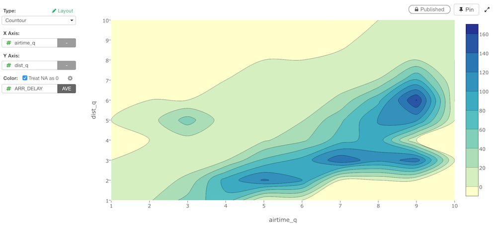

# Contour 

## Column Assignments

* X-Axis - Assign a column you want to show at X-Axis. You can assign any column with continuous values (number column). 
* Y-Axis - Assign a column you want to show at X-Axis. You can assign any column with continuous values (number column). 
* Color - Take a look at [Color](color.md) section for more details.

## Layout Configuration

Take a look at [Layout Configuration](layout.md) on how to configure the layout and format. 
