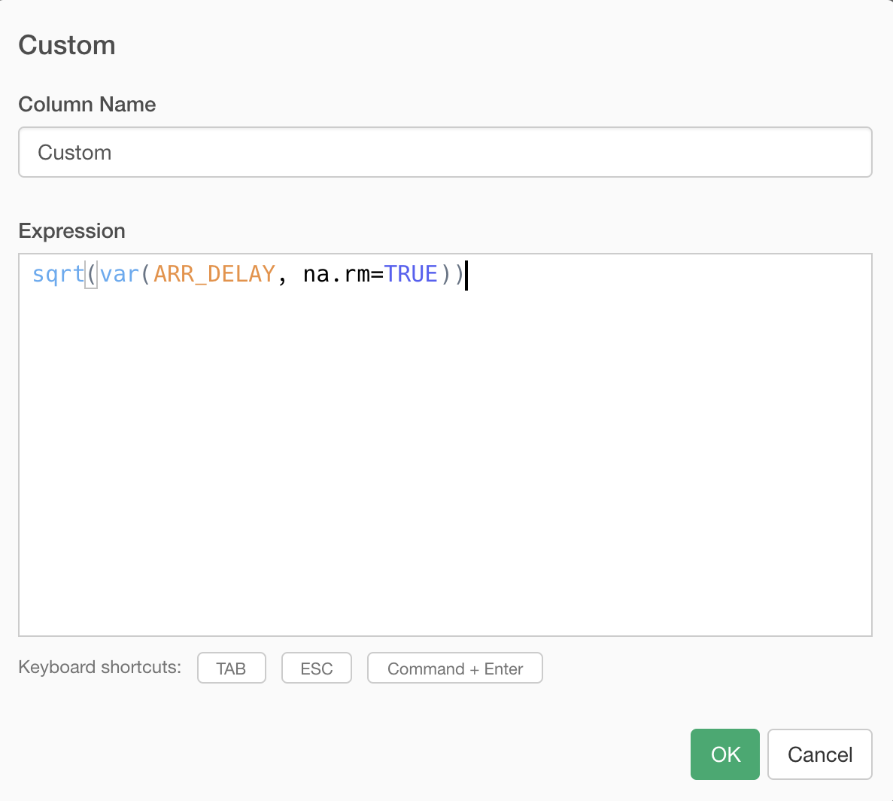
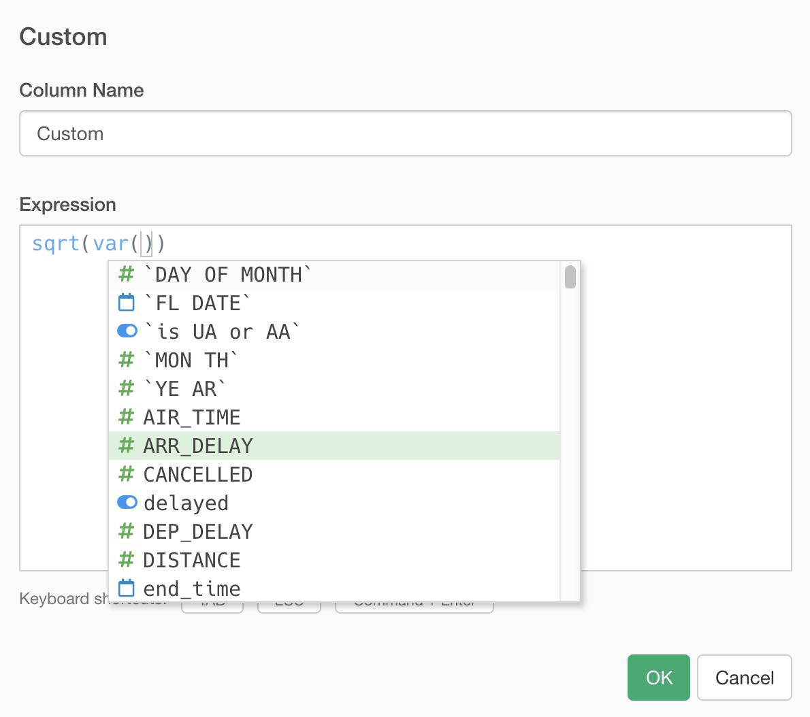

# Custom Function

The Custom Function feature allows you to define your own aggregation function as a column. Custom Function is available in the following charts. 

* Pivot Table (Value)

## Creating a Custom Function 

If you click a column selection that supports the Custom Function, it shows "(Custom)" menu. 

You can choose the "(Custom)" menu from the column selection dropdown that supports the Custom Function. 

Once you choose it, it shows up the Custom Function dialog. You can define your own function here. 

The expression text at the Expression should an R expression, and it should return a single value as a result. You can refer to any functions and columns in the current data frame that you are using. You can hit the Tab key to show the suggestion in the Expression Editor.   

Once you are done, hit the OK button, then it will show the result. 

