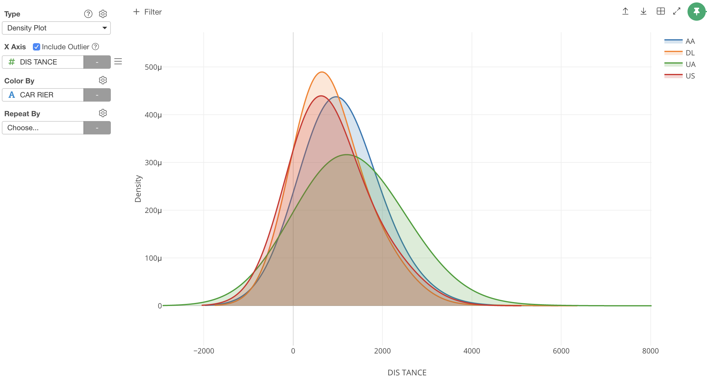

##  Density Plot 

You can show the distribution of the data by the curved lines. This chart is a variation of a Histogram, but this can show the smoother distributions by smoothing out the noise.  

## Column Assignments

* X-Axis - Assign a column you want to show the distribution. The column data should be numeric. 
* Color By - Assign a column for color. Take a look at [Color](color.md) section for more details.
* Repeat By - You can assign a column to repeat the chart for each of its values. Take a look at [Repeat By](small-multiple.md) section for more details.
* Include Outlier - You can uncheck to exclude the outlier values. 

## Highlight 

You can change the color of the specific markers such as bars, lines or circles that you pick to stand out from others. See [Highlight](highlight.md) for the detail. 

## Category 

You can categorize numeric values inside the chart. See [Category(Binning)](category.md) for the detail.

## Limit Values

You can use Limit Values to filter the categories by the aggregated values. See [Limit Values](limit.md) for the detail.

## Missing Value Handling

You can use the Missing Value Handling feature to control missing values. See [Missing Value Handling](missing-value-handling.md) for the detail.

## Layout Configuration

* Bandwidth Adjustment - Decides the smoothness of lines. You can assign a numeric value. If you assign a larger number, the curve will be simpler. 
* Number of Equally Spaced Points - How many data points used to draw the line. If you assign a larger number, the curve will be smoother. 
* Bandwidth - Smoothing bandwidth option. 
* Kernel - Smoothing kernel option. 

Take a look at [Layout Configuration](layout.md) on how to configure the layout and format. 
