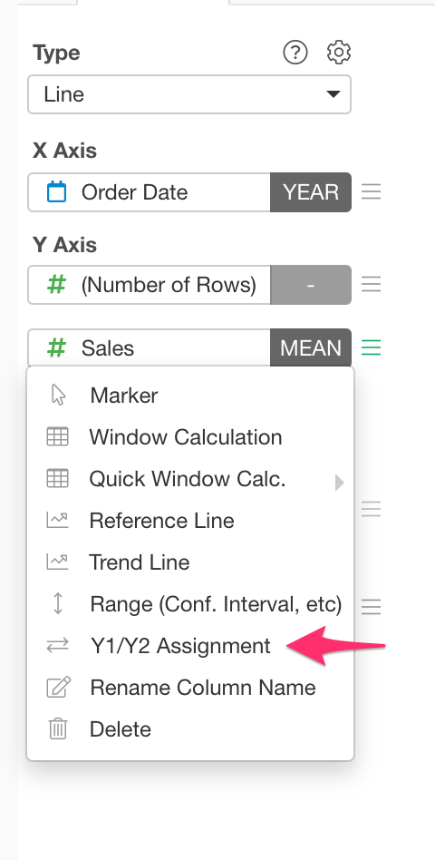
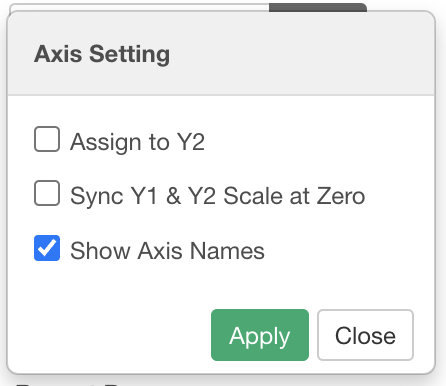

# Axis Setting
 
You can change axis configurations in "Axis Setting" dialog. You can acesss it from "Y1/Y2 Assignment" Y-Axis menu. 

You can change the following configurations.

* Assign to Y2: If you check it, the column is assigned to Y2 axis (on the right hand side of the chart).
* Sync Y1 & Y2 Scale at Zero: If you check it, it will align the Y-axis zero lines on Y1 and Y2. 
* Show Axis Names: If you check it, it shows which axis (either "(Y1)" or "(Y2)") is assigned for each column in the legend.

This menu currently shows up in Y-Axis menu only when you have multiple columns at Y-Axis.  
