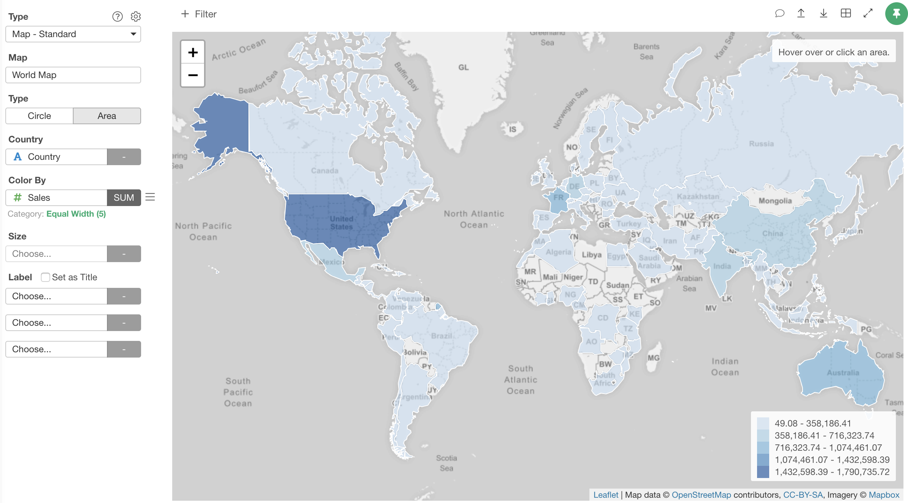
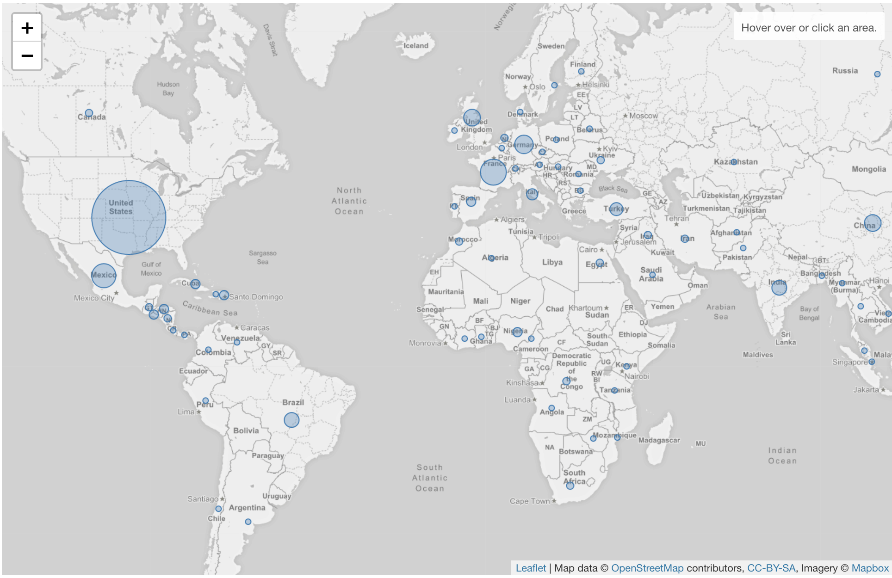
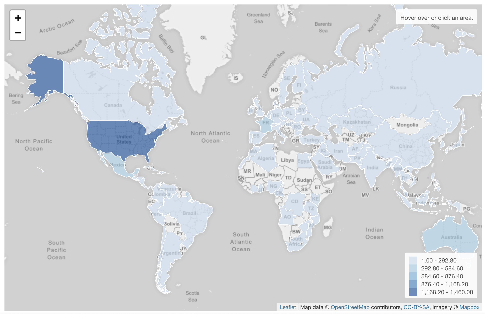

# Map - Standard

## Column Assignments
* Map - Select a map you want to use. 
* Type - Select the map type. Either Circle or Area.
* Region (such as Country, State, Prefecture, County etc) - Assign a column that has the regional information. 
* Color By - Assign a column for color. If you assign a categorical column, it will be also used as a groupby column. Take a look at [Color](color.md) section for more details.
* Size - Assign a column for the circle size. It is only available for "Circle" map type.
* Label - Assign a column you want to show in the balloon help that you see when you hover circles on the map. If you click "Set as Title" checkbox, the values of the 1st label column will show up at the top as title in the balloon when you hover a region or circle.

## Type 

You can choose either "Circle" or "Area" type.

### Circle

You can visualize the data by circles. 

### Area Type

You can visualize the data by the shape of regisons. 

## Highlight 

You can change the color of the specific reigons that you pick to stand out from others. It is available only when you assgin a categorical column to color. See [Highlight](highlight.md) for the detail. 

## Category 

You can categorize numeric values inside the chart. See [Category(Binning)](category.md) for the detail.

## Custom Function

You can use the Custom Function feature to define your own aggregation function. See [Custom Function](custom-function.md) for the detail.
