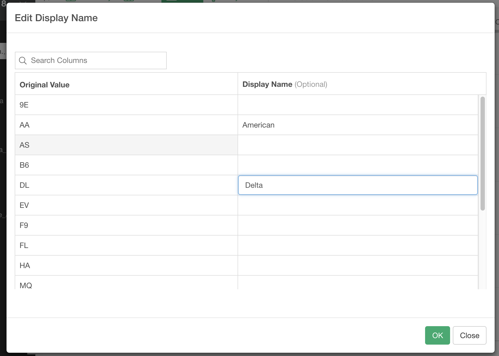

# Edit Display Names
 
You can edit the display name of the values on the chart. 

For example, if you have a chart like following.

If you want to rename "AA" to "American" and "DL" to "Delta", you can set the display names like this in the Edit Display Name dialog. 

Then the output will be like this. 

You can set the same display name for multiple values. In this case, those values will be combined into the new display name. For example, you set the samedisplay name "Grouop A" to "9E", "AA", "AS", "B6", "DL, "EV" and "F9".

This is the output. Those values will be combined into "Group A". 

