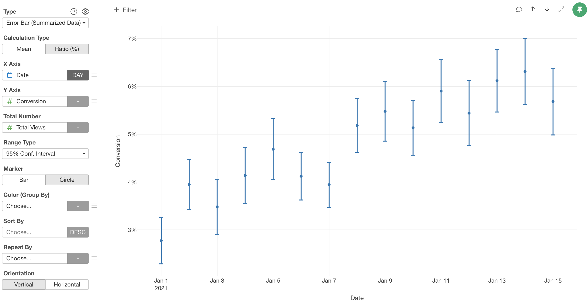

# Error Bar (Summarized Data) Chart

With the Error Bar (Summarized Data) Chart, you can create an Error Bar using the data which is already summarized/aggregated. 


For example, if you have the website access data and the number of conversions (number of people who visited this website and became paid users, for example) like the following.  


|Date|	Total Views|	Conversion|
|--|--|--|
|2021-01-01|	4435|	123|
|2021-01-02|	5345|	211|
|2021-01-03|	3851|	134|
|2021-01-04|	4421|	183|
|2021-01-05|	4245|	199|
|2021-01-06|	6113|	252|
|2021-01-07|	6541|	258|
|2021-01-08|	6018|	312|
|2021-01-09|	5109|	280|
|    :     | : | : |


You can create an Error Bar chart with this data by following steps.

* Create a new chart and select "Error Bar (Summarized Data)" Type.
* Select "Ratio" for the Calculation Type.
* Assign "Date" to X Axis.
* Assign "Convertion" to Y Axis.
* Assign "Total Views" to Total Number.
* Select "Circle" for the Marker.




## Assignments

* Calculation Type - You can select an error bar calculation type from the following options. The default is `Mean`.
  * Mean - Average based error bar chart. 
  * Ratio (%) - Ratio based error bar chart based on the count of values. 
* X-Axis - Assign a column you want to show at X-Axis. If it's a Date / Time column assigned, you can select the aggregation level such as `Month`, `Week`, `Day`, etc. If you assign a Number column, you can choose either `As Number` to treat values as continuous values or `As Text` to treat values as categorical values.  
* Y-Axis - Assign a column you want to show at Y-Axis. 
  * If the calculation type is `Mean`, assgin the mean value of each group. 
  * If the calculation type is `Ratio (%)`, assign the target count of each group.
* Total Number - Assign a column that contains the total number of each group.
* Standard Deviation - Assign a column that contains the standard deviation of each group. Only for the "Mean" Calculation Type.
* Range Type - You can select an error bar range type from the following options. The default is `95% Confidence Interval`.
  * 90% Confidence Interval 
  * 95% Confidence Interval 
  * 99% Confidence Interval 
* Marker - You can select a marker type from the following options. The default is `Bar`.
  * Bar - Suitable for comparing actual values and error bar ranges. 
  * Circle - Suitable for comparing error bar ranges. 
* Color - Take a look at [Color](color.md) section for more details.
* Sort By - Assign a column to use for Sorting the X-Axis values. The default is based on either the alphabetic order or the factor level order for Factor type columns.
* Repeat By - You can assign a column to repeat the chart for each of its values. Take a look at [Repeat By](small-multiple.md) section for more details.
* Orientation - You can choose a chart orientation. Either 'Vertical' or 'Horizontal'.


## Confidence Interval Range Calculation Formula

### Calculation Type: Mean

Formula in R.

``` 
qt((level + 1)/2, df=n-1) * sd / sqrt(n) 


level: 0.90 (90% Confidence Interval)
       0.95 (95% Confidence Interval)
       0.99 (99% Confidence Interval)
n:     Total Number
sd:    Standard Deviation
```


### Calculation Type: Ratio (%) 

Formula in R.

``` 
qnorm((level + 1)/2) * sqrt(ratio * (1 - ratio)/n)

level: 0.90 (90% Confidence Interval)
       0.95 (95% Confidence Interval)
       0.99 (99% Confidence Interval)
n:     Total Number
ratio: Ratio calculated by dividing 
       the Count by the Total Number. (0-1)
```


## Reference Line

Take a look at [Reference Line](reference-line.md) section for more details.


## Style 

You can change the error bar styles from the "Style" setting at Y-Axis. You can change the followings.
* Line Width: Thickness of the error bars.
* Circle Size: Size of the circle. Available only for "Circle" marker option.
* Horizontal Bar Width: Length of the horizontal bar part of the error bars. 


## Highlight 

You can change the color of the specific markers such as bars, lines or circles that you pick to stand out from others. See [Highlight](highlight.md) for the detail. 

## Category 

You can categorize numeric values inside the chart. See [Category(Binning)](category.md) for the detail.

## Limit Values

You can use Limit Values to filter the categories by the aggregated values. See [Limit Values](limit.md) for the detail.


## Missing Value Handling

You can use the Missing Value Handling feature to control missing values. See [Missing Value Handling](missing-value-handling.md) for the detail.


## Layout Configuration

Take a look at [Layout Configuration](layout.md) on how to configure the layout and format. 

## Save as an Image

You can save the chart as an image file. See [Save as PNG/SVG](save.md) for more details.
