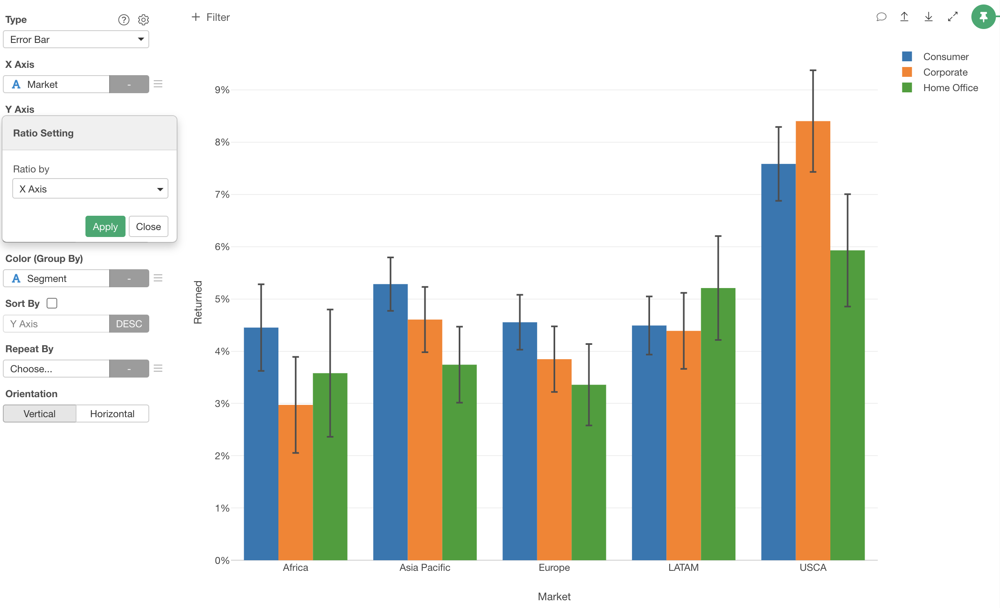

# Error Bar Chart

## Assignments

* Calculation Type - You can select an error bar calculation type from the following options. The default is `Mean`.
  * Mean - Average based error bar chart. 
  * Ratio (%) - Ratio based error bar chart based on the count of values. 
* Marker - You can select a marker type from the following options. The default is `Bar`.
  * Bar - Suitable for comparing actual values and error bar ranges. 
  * Circle - Suitable for comparing error bar ranges. 
* X-Axis - Assign a column you want to show at X-Axis. If it's a Date / Time column assigned, you can select the aggregation level such as `Month`, `Week`, `Day`, etc. If you assign a Number column, you can choose either `As Number` to treat values as continuous values or `As Text` to treat values as categorical values.  
* Y-Axis - Assign a column you want to show at Y-Axis. 
  * If the calculation type is `Mean`, you can only choose `Average` for the column function. 
  * If the calculation type is `Ratio (%)`, you can only choose one of the count-based functions following for the column function.
    * Count 
    * Unique Count 
    * Number of TRUE (logical only)
    * Number of FALSE (logical only)
* Range Type - You can select an error bar range type from the following options. The default is `Standard Error`.
  * Standard Error 
  * 95% Confidence Interval 
  * 99% Confidence Interval 
  * 1 Standard Deviation
  * 2 Standard Deviation
  * 3 Standard Deviation
  * IQR
* Color - Take a look at [Color](color.md) section for more details.
* Sort - Assign a column to use for Sorting the X-Axis values. The default is based on either the alphabetic order or the factor level order for Factor type columns.
* Repeat By - You can assign a column to repeat the chart for each of its values. Take a look at [Small Multiple](small-multiple.md) section for more details.
* Orientation - You can choose a chart orientation. Either 'Vertical' or 'Horizontal'.

## Range Calculation Formula

### Calculation Type: Mean

* Standard Error 
 

* 95% Confidence Interval
 

* 99% Confidence Interval
 

### Calculation Type: Ratio (%) 

* Standard Error
 

* 95% Confidence Interval
 

* 99% Confidence Interval
 

## Reference Line

Take a look at [Reference Line](reference-line.md) section for more details.

## Highlight 

You can change the color of the specific markers such as bars, lines or circles that you pick to stand out from others. See [Highlight](highlight.md) for the detail. 

## Category 

You can categorize numeric values inside the chart. See [Category(Binning)](category.md) for the detail.

## Limit Values

You can use Limit Values to filter the categories by the aggregated values. See [Limit Values](limit.md) for the detail.

## Group Setting 

If the calculation type is `Ratio (%)`, you can set how to group by for the percentage calculation in Group Setting dialog. You can reach the Group Setting dialog from the Y Axis menu. Following group by options are available. The default value is `X Axis`.

* X Axis - Calculate the ratio for each X Axis data point. The total percentages on each X value will be 100%. For example, the total percentatge of all the color bars on `Sun` becomes 100%. 

* Color - Calculate the ratio for each color value. The total percentage on each color value will be 100%. For example, total percentatge of all the blue bars becomes 100%.

* All - Calculate the ratio based on all data point. The total percentage of all the data point will be 100%.

## Layout Configuration

Take a look at [Layout Configuration](layout.md) on how to configure the layout and format. 
