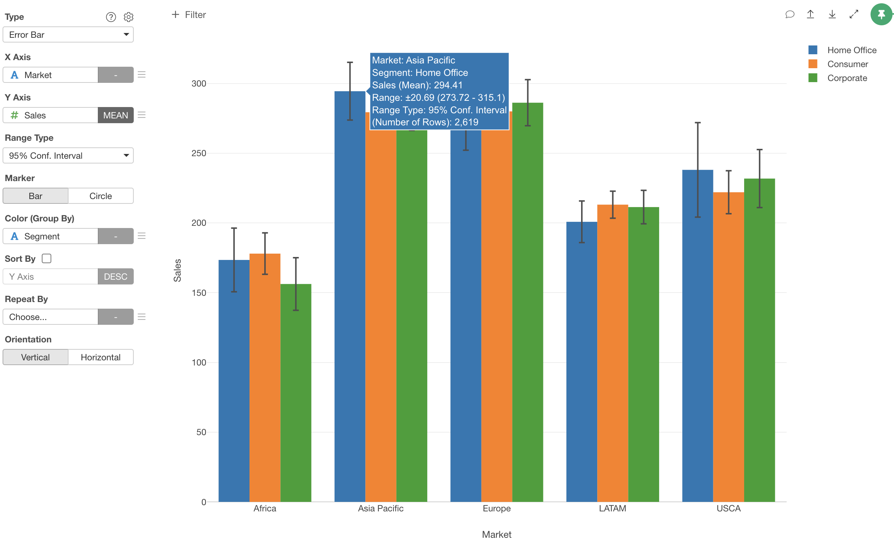
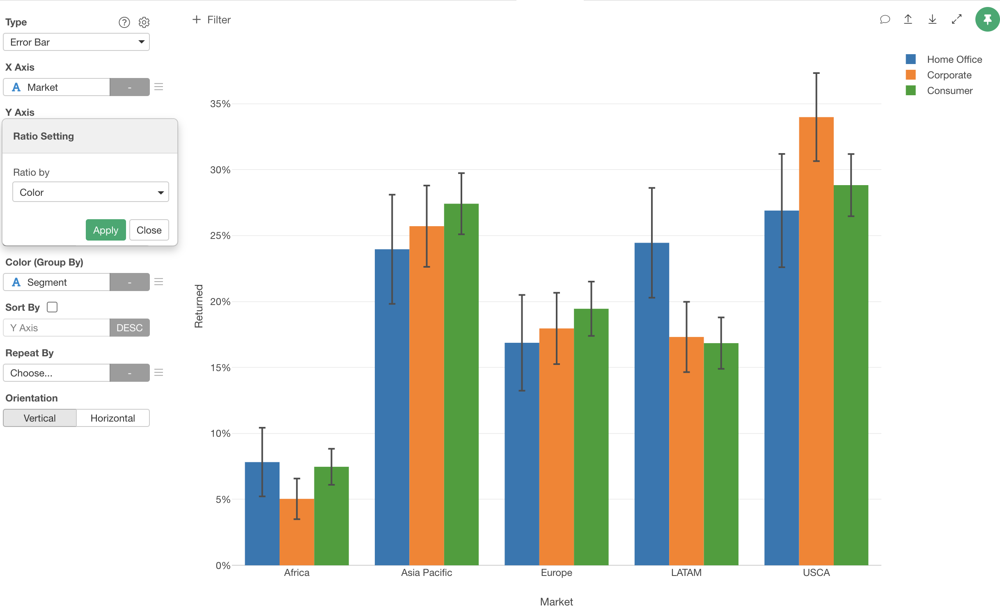

# Error Bar Chart

## Mean mode and Ratio mode.

The Error Bar has 2 modes, Mean mode and Ratio mode. The mode automatically switches depending on the column data type and aggregation function that you assign to Y-Axis. 

### Mean mode

If you assign a numeric column to Y-Axis and choose either "Mean" or "Conditional Mean" for the aggregation function, it becomes the Mean mode. The Error Bar calculation is based on the mean values. 

### Ratio mode

If you assign a column and aggregation function that don't match the Mean mode criteria, it becomes the Ratio mode. The Error Bar calculation is based on the ratio of the values.

## Assignments

* X-Axis - Assign a column you want to show at X-Axis. If it's a Date / Time column assigned, you can select the aggregation level such as `Month`, `Week`, `Day`, etc. If you assign a Number column, you can choose either `As Number` to treat values as continuous values or `As Text` to treat values as categorical values.  
* Y-Axis - Assign a column you want to show at Y-Axis. The Error Bar mode automatically switches depending on the column data type and aggregation function. See "Mean mode and Ratio mode" above for details.
* Range Type - You can select an error bar range type from the following options. The default is `Standard Error`.
  * Standard Error 
  * 90% Confidence Interval 
  * 95% Confidence Interval 
  * 99% Confidence Interval 
  * 1 Standard Deviation (Available only in Mean mode)
  * 2 Standard Deviation (Available only in Mean mode)
  * 3 Standard Deviation (Available only in Mean mode)
  * 1.5 IQR (Available only in Mean mode)
* Marker - You can select a marker type from the following options. The default is `Bar`.
  * Bar - Suitable for comparing actual values and error bar ranges. 
  * Circle - Suitable for comparing error bar ranges. 
* Color - Take a look at [Color](color.md) section for more details.
* Sort By - Assign a column to use for Sorting the X-Axis values. The default is based on either the alphabetic order or the factor level order for Factor type columns.
* Repeat By - You can assign a column to repeat the chart for each of its values. Take a look at [Repeat By](small-multiple.md) section for more details.
* Orientation - You can choose a chart orientation. Either 'Vertical' or 'Horizontal'.

## Range Calculation Formula

### Mean mode

* Standard Error 
 

* 95% Confidence Interval
 

* 99% Confidence Interval
 

### Ratio mode

* Standard Error
 

* 95% Confidence Interval
 

* 99% Confidence Interval
 

## Reference Line

Take a look at [Reference Line](reference-line.md) section for more details.

## Style 

You can change the error bar styles from the "Style" setting at Y-Axis. You can change the followings.
* Line Width: Thickness of the error bars.
* Circle Size: Size of the circle. Available only for "Circle" marker option.
* Horizontal Bar Width: Length of the horizontal bar part of the error bars. 

## Highlight 

You can change the color of the specific markers such as bars, lines or circles that you pick to stand out from others. See [Highlight](highlight.md) for the detail. 

## Category 

You can categorize numeric values inside the chart. See [Category(Binning)](category.md) for the detail.

## Limit Values

You can use Limit Values to filter the categories by the aggregated values. See [Limit Values](limit.md) for the detail.

## 'Others' Group

If you have many categories, you can reduce the number of categories by changing some category names to 'Others' using the 'Others' Group feature. See ['Others' Group](others-group.md) for the detail. 

## Ratio Setting 

If the Error Bar is in Ratio mode, you can set how to group by for the percentage calculation in Ratio Setting dialog. You can reach the Ratio Setting dialog from the Y Axis menu. The following group by options are available. The default value is `X Axis`.

* X Axis - Calculate the ratio for each X Axis and Color group. For example, the TRUE ratio of the Africa and Corporate (Blue bar at Africa) is 4.5%.

* Color - Calculate the ratio for each color value. The total percentage of each color value becomes 100%. For example, the total percentatge of all the blue bars is 100%.

* All - Calculate the ratio based for the entire data. The total percentage of all bars in all colors becomes 100%.

## Missing Value Handling

You can use the Missing Value Handling feature to control missing values. See [Missing Value Handling](missing-value-handling.md) for the detail.

## Show Detail

You can show the detailed data underlying the chart by clicking the chart figure. See [Show Detail](show-detail.md) for the detail.

## Layout Configuration

Take a look at [Layout Configuration](layout.md) on how to configure the layout and format. 

## Save as an Image

You can save the chart as an image file. See [Save as PNG/SVG](save.md) for more details.
