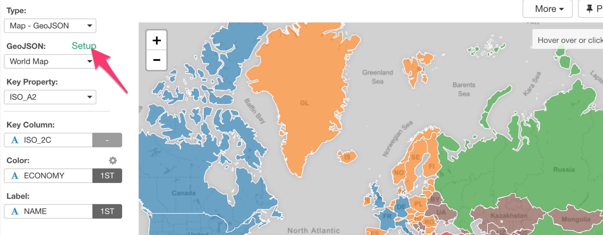
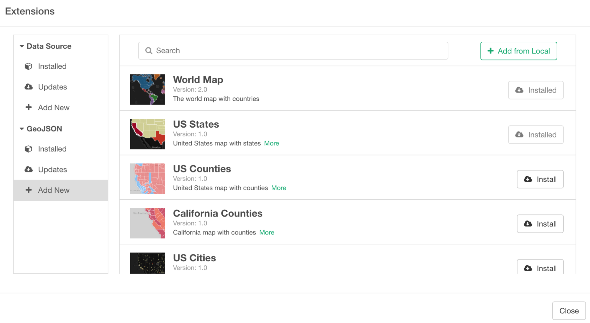
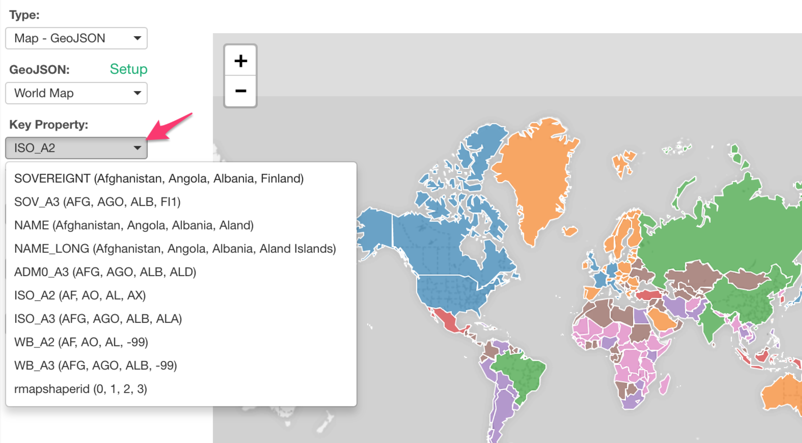
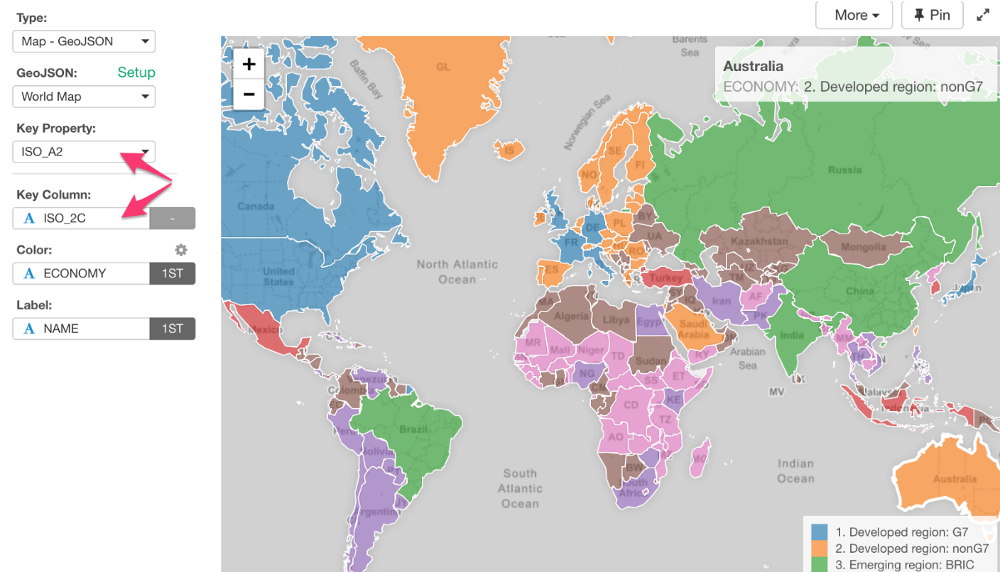

# Map - Area

### How to Use GeoJSON Map?

#### Open GeoJSON Map Extension Dialog

In Viz view, you can click ‘Setup’ button after selecting ‘Map — GeoJSON’ chart type.

#### Find GeoJSON Map in Extensions Dialog inside Exploratory

Once you find the one you like, you can click ‘Install’ button, and now you are ready to start using it under Viz tab.

Once you find the one you like, you can click ‘Install’ button, and now you are ready to start using it under Viz tab.

#### Choosing a Key Property from GeoJSON

Each GeoJSON file provides a list of the properties that you can use to map with your data the way it works the best.

#### Mapping between GeoJSON’s key property and your data

The example below, I’m using ISO standard country codes found in the data and map them with ‘ISO_A2’ property of World Map GeoJSON.

### How to Create My GeoJSON?

Here's how you can create your own GeoJSON files from existing ESRI Shapefile or other formats using R.

* [Creating GeoJSON out of Shapefile in R](https://blog.exploratory.io/creating-geojson-out-of-shapefile-in-r-40bc0005857d)

## Highlight 

You can change the color of the specific markers such as bars, lines or circles that you pick to stand out from others. See [Highlight](highlight.md) for the detail. 

## Category 

You can categorize numeric values inside the chart. See [Category(Binning)](category.md) for the detail.

## Limit Values

You can use Limit Values to filter the categories by the aggregated values. See [Limit Values](limit.md) for the detail.

## Layout Configuration

Take a look at [Layout Configuration](layout.md) on how to configure the layout and format. 
