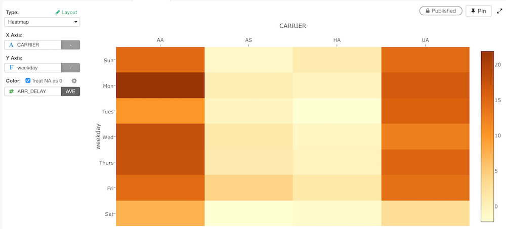

# Heatmap

## Column Assignments

* X-Axis - Assign a column you want to show at X-Axis. You can assign any column with discrete values (text or number column). If it's a Date / Time column assigned, you can select the aggregation level such as `Month`, `Week`, `Day`, etc.   
* Y-Axis - Assign a column you want to show at Y-Axis. You can assign any column with discrete values (text or number column). If it's a Date / Time column assigned, you can select the aggregation level such as `Month`, `Week`, `Day`, etc.  
* Color - Take a look at [Color](color.md) section for more details.

## Layout Configuration

Take a look at [Layout Configuration](layout.md) on how to configure the layout and format. 

## Links

You can check out the following articles for more information. 

* [Quick Introduction to Heatmap in Exploratory](https://blog.exploratory.io/quick-introduction-to-heatmap-c21a9f9e4644)
