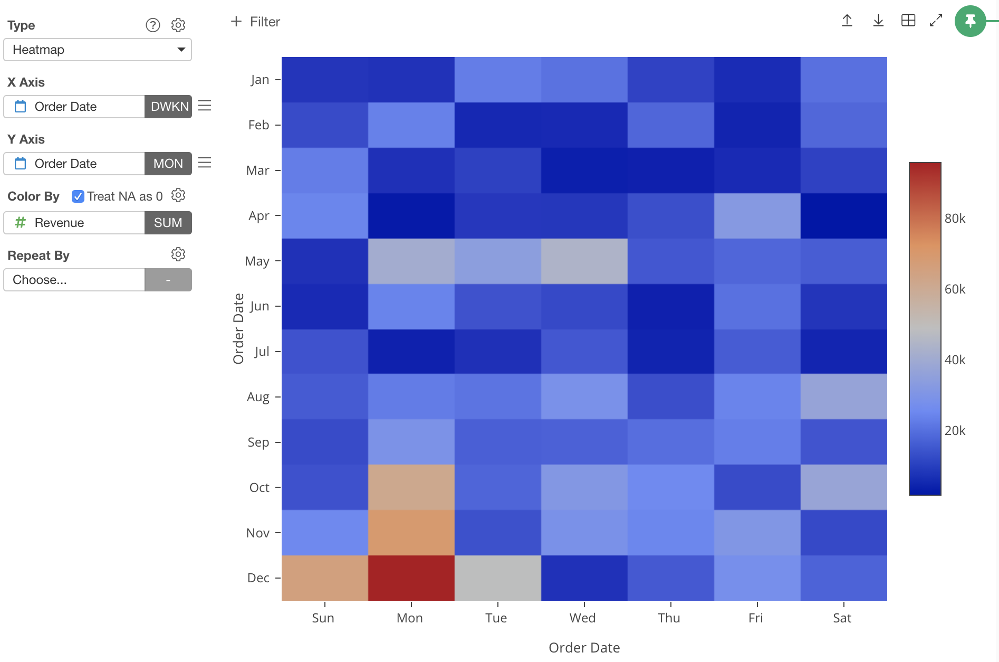
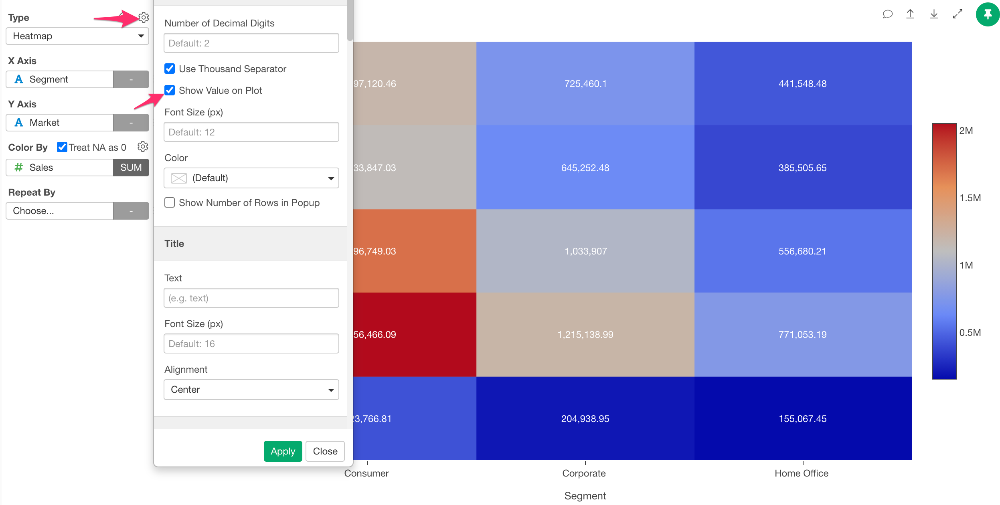
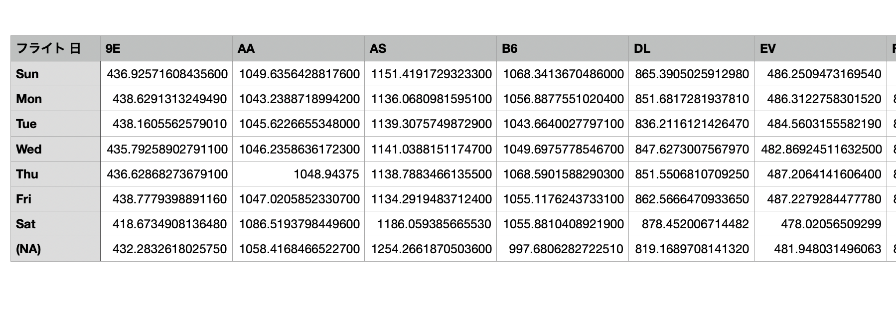

# Heatmap

## Column Assignments

* X-Axis - Assign a column you want to show at X-Axis. You can assign any column with discrete values (text or number column). If it's a Date / Time column assigned, you can select the aggregation level such as `Month`, `Week`, `Day`, etc.   
* Y-Axis - Assign a column you want to show at Y-Axis. You can assign any column with discrete values (text or number column). If it's a Date / Time column assigned, you can select the aggregation level such as `Month`, `Week`, `Day`, etc.  
* Color - Take a look at [Color](color.md) section for more details.
* Repeat By - You can assign a column to repeat the chart for each of its values. Take a look at [Repeat By](small-multiple.md) section for more details.

## Show Values on Plot

You can show the column values at "Color By" on the plot area by checking the "Show Value on Plot" checkbox.

## Category 

You can categorize numeric values inside the chart. See [Category(Binning)](category.md) for the detail.

## Custom Function

You can use the Custom Function feature to define your own aggregation function. See [Custom Function](custom-function.md) for the detail.

## Layout Configuration

Take a look at [Layout Configuration](layout.md) on how to configure the layout and format. 

## Exporting Chart Data 

Unlike the other chart types, if you export the Heatmap chart data, the data will be saved in in a wide format.  

## Save as an Image

You can save the chart as an image file. See [Save as PNG/SVG](save.md) for more details.

## Links

You can check out the following articles for more information. 

* [Quick Introduction to Heatmap in Exploratory](https://blog.exploratory.io/quick-introduction-to-heatmap-c21a9f9e4644)

