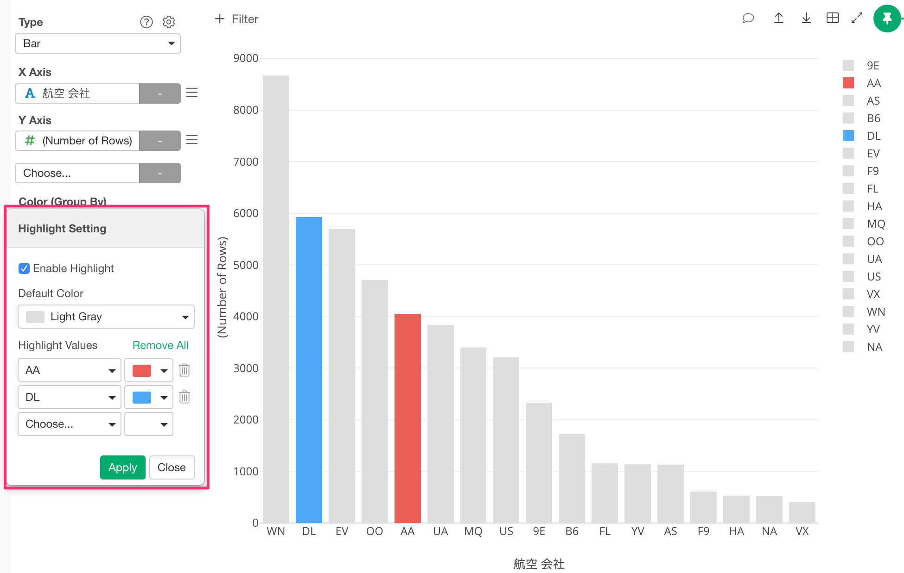

# Highlight

By using the Highlight feature, you can change the color of specific markers such as bars, lines or circles to stand out from others. Highlight feature is available in the following charts. 

* Bar
* Line 
* Area 
* Ring / Pie 
* Histogram 
* Density Plot 
* Scatter (No Aggregation) 
* Scatter (With Aggregation) 
* Boxplot 
* Violin 
* Error Bar 
* Area Map 
* Long/Lat Map 

## How to Use 

First, you need to assign a category column such as a character column to Color. Then, select "Highlight" menu from the menu dropdown. 

Check "Enable Highlight" to enable the Highlight feature. Choose values to highlight, and pick colors for each value. Click Apply to apply the highlight configuration. 

