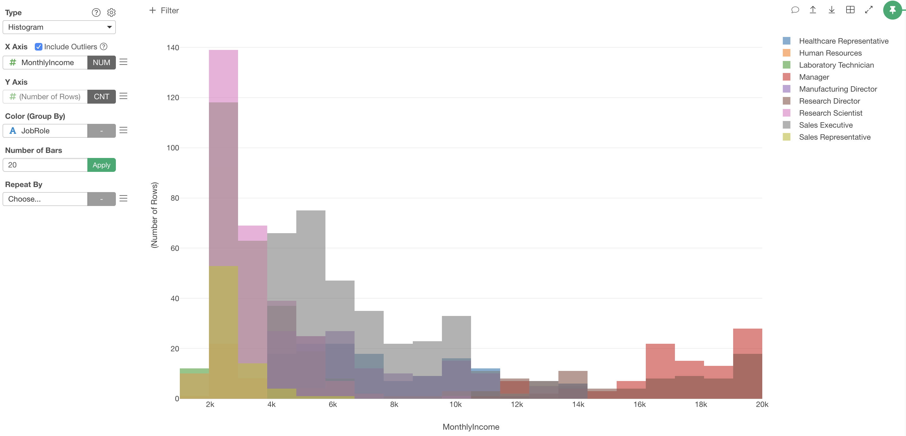
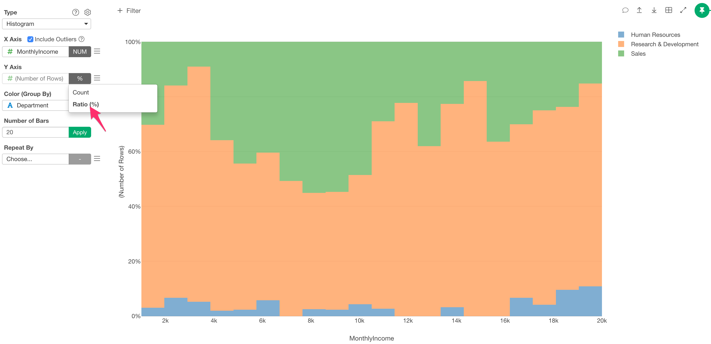
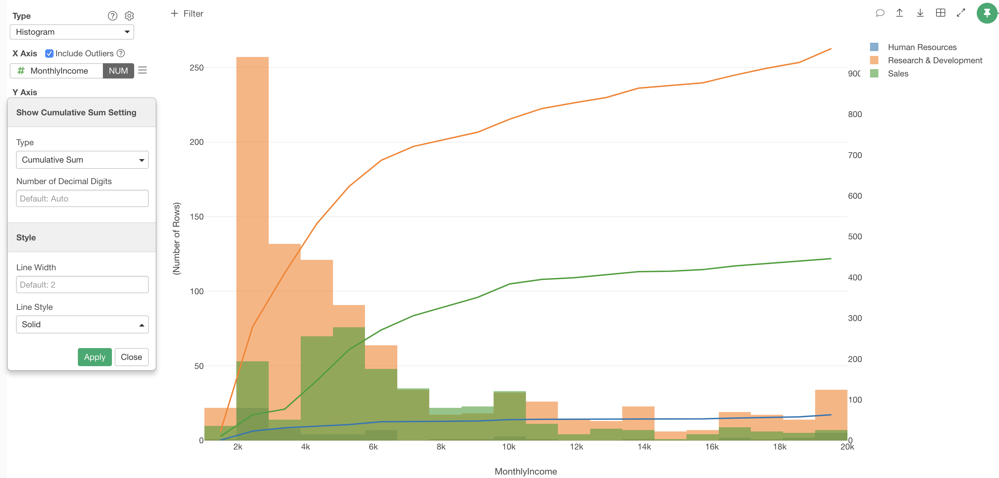
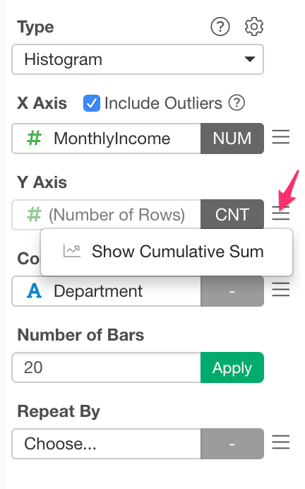

# Histogram Chart

## Column Assignments

* X-Axis - Assign a column you want to show its distribution. You can assign only a number based column here.
* Y-Axis - It is fixed to "Number of Rows". You can select how you want to show the bars at the function dropdown. See ["Ratio Mode"](#ratio-mode) for detail.
* Color - Take a look at [Color](color.md) section for more details.
* Number of Bars - Specify the number of bars. The default is `Automatic`.
* Repeat By - You can assign a column to repeat the chart for each of its values. Take a look at [Small Multiple](small-multiple.md) section for more details.

## Count/Ratio Mode

You can select how to show the histogram bars at the function dropdown of Y-Axis control. The following options are available. 

* Count - Each bar represents a count of the bucket. This is the default mode.
* Ratio (%) - Show the bars in ratio (%). You need to assign a column to Color. 

## Cumulative Sum Reference Line 

You can show the cumulative sum reference lines. 

You can open the setting dialog from "Show Cumulative Sum" menu at Y-Axis.

Following options are available. 

* Type 
  * Cumulative Sum - Cumulative sum of bars.
  * Cumulative Sum Ratio (%) - Ratio of the cumulative sum values against the total value. Lines start from 0% and end with 100%. 
* Number of Decimal Digits - Number of decimal digits for the cumulative sum lines. 
  * Line Width: Thickless of the line.
* Line Style 
  * Solid
  * Dotted 
  * Dot and Dash

## Highlight 

You can change the color of the specific markers such as bars, lines or circles that you pick to stand out from others. See [Highlight](highlight.md) for the detail. 

## Category 

You can categorize numeric values inside the chart. See [Category(Binning)](category.md) for the detail.

## Limit Values

You can use Limit Values to filter the categories by the aggregated values. See [Limit Values](limit.md) for the detail.

## Missing Value Handling

You can use the Missing Value Handling feature to control missing values. See [Missing Value Handling](missing-value-handling.md) for the detail.

## Layout Configuration

Take a look at [Layout Configuration](layout.md) on how to configure the layout and format. 
