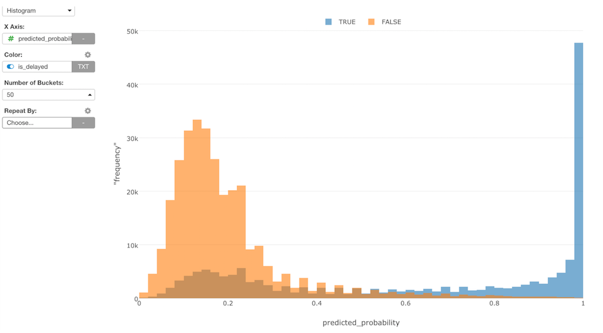

# Histogram Chart

## Column Assignments

* X-Axis - Assign a column you want to show its distribution. You can assign only a number based column here.
* Color - Take a look at [Color](color.md) section for more details.
* Repeat By - You can assign a column to repeat the chart for each of its values. Take a look at [Small Multiple](small-multiple.md) section for more details.

## Number of Buckets

You can select one of following number of buckets options. The default is `Automatic`

* Automatic 
* 5
* 10
* 15
* 20
* 25
* 50
* 100
* 200
* 500
* 1000

## Highlight 

You can change the color of the specific markers such as bars, lines or circles that you pick to stand out from others. See [Highlight](viz/highlight.md) for the detail. 

## Layout Configuration

Take a look at [Layout Configuration](layout.md) on how to configure the layout and format. 
