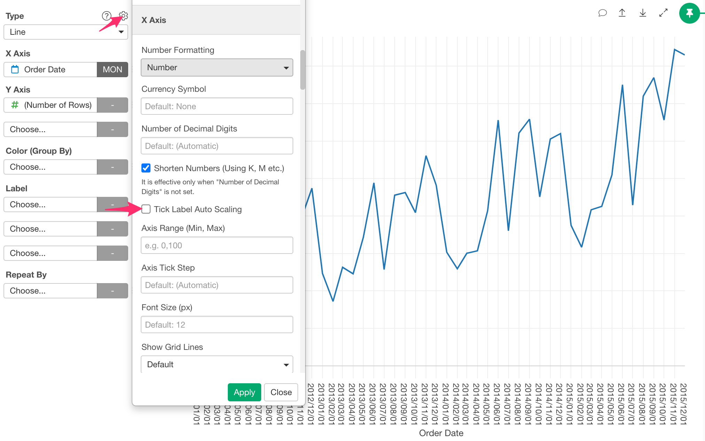
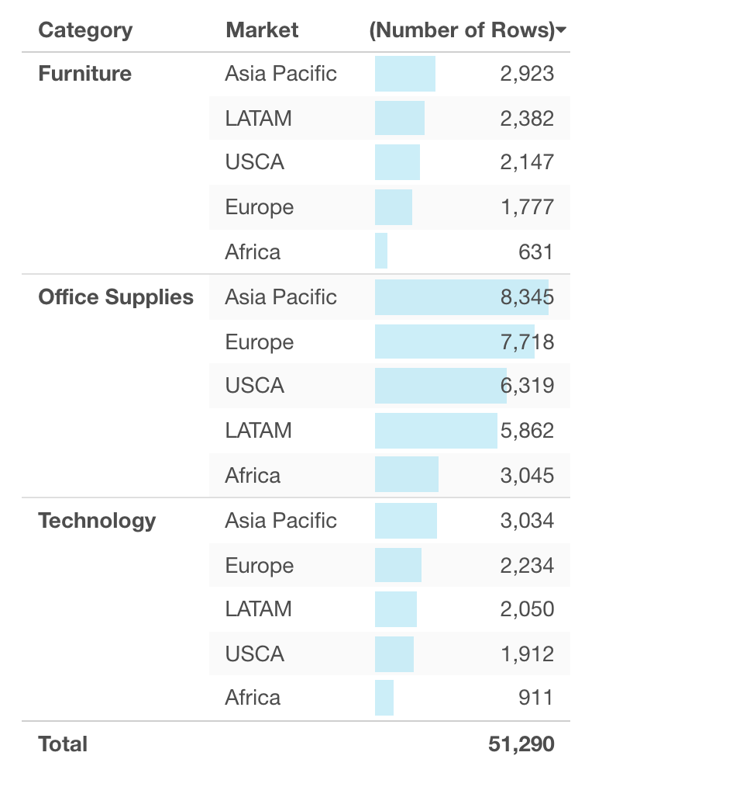
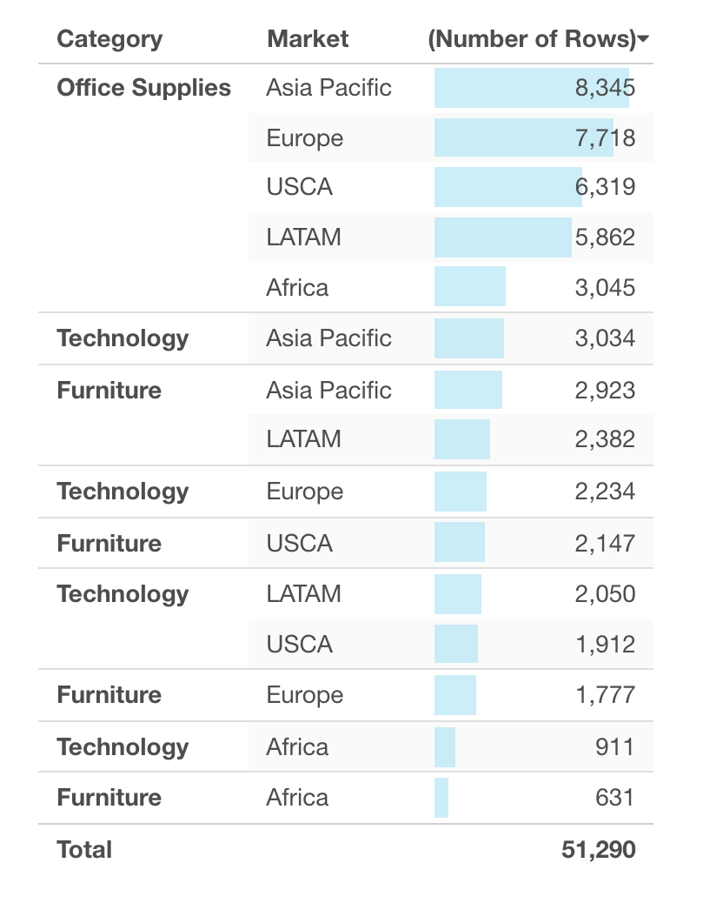

# Configure Layout and Format

You can configure the layout and format of the chart such as margins, font size or title on the Layout property dialog. You can access to the dialog by clicking "Layout" button at the top right corner of the chart. 

The dialog content changes depending on the chart type. See following for more detail. 

## Generic Charts

Generic Charts includes following chart types.  
* Bar 
* Line 
* Area 
* Pie / Ring 
* Histogram
* Density Plot 
* Scatter (No Aggregation) 
* Scatter (With Aggregation)
* Boxplot
* Violin
* Error Bar
* Heatmap 
* Contour 

Following layout properties are available for those type of charts. 

* Plot Area 
  * Number of Decimal Digits - Number of decimal digits to round. 
  * Show Values on Plot
    * (None)
    * Above
    * Middle - Available only on Bar, Error Bar and Error Bar (Summarized Data) chart types.
    * Below
* Legend 
  * Position 
    * Right - Default
    * Left
    * Top 
    * Bottom 
    * None - Hide legend itself
  * Font Size - Font size for the legend text in pixel
* Title 
  * Text - Title text
  * Font Size (numbers in pixel)
  * Alignment
* X Axis Title
  * Title Text 
  * Title Font Size (numbers in pixel)
* X Axis 
  * Show Label
  * Tick Label Font Size (numbers in pixel)
  * Show Grid Lines 
    * Default - Depending on chart type 
    * On - Show explicitly
    * Off - Hide explicitly
  * Show Zero Lines 
    * Default - Depending on chart type 
    * On - Show explicitly 
    * Off - Hide explicitly
* Y Axis Title
  * Title Text 
  * Title Font Size (numbers in pixel)
* Y Axis 
  * Show Label
  * Tick Label Font Size - Font size in pixel
  * Show Grid Lines 
    * Default - Depending on chart type 
    * On - Show explicitly 
    * Off - Hide explicitly
  * Show Zero Lines 
    * Default - Depending on chart type 
    * On - Show explicitly 
    * Off - Hide explicitly 
* Z Axis Title
  * Title Text 
  * Title Font Size (numbers in pixel)
* Z Axis (Only available for Scatter (No Aggregation) charts with Z-Axis assigned) 
  * Show Label
  * Tick Label Font Size (numbers in pixel)
  * Show Grid Lines 
    * Default - Depending on chart type
    * On - Show explicitly
    * Off - Hide explicitly
  * Show Zero Lines 
    * Default - Depending on chart type
    * On - Show explicitly
    * Off - Hide explicitly 
* Margin 
  * Top  (numbers in pixel)
  * Left  (numbers in pixel)
  * Bottom  (numbers in pixel)
  * Right (numbers in pixel)

### Tick Label Auto Scaling

If you assign a numeric, Date or POSIXct column to X-Axis and you want to show the labels for all the data points on X-Axis, you can uncheck the "Tick Label Auto Scaling" option. This option is currently avaiable in Bar, Line and Area charts. 

## Maps

Maps includes following chart types.
* Map - Long/Lat  
* Map - Heatmap
* Map - GeoJSON

Following layout properties are available for those type of charts. 

* Plot Area 
  * Number of Decimal Digits - Number of decimal digits to round. 
* Map 
  * Type - Map type
    * Light 
    * Dark 
    * Streets

## Pivot Table / Summarize Table

The following layout properties are available for Pivot Table and Summarize Table.

* General
  * Font Size
  * Show All Categorical Values - If you assign a factor column to Row, Column or Group By, show all the categories (factor levels) even there is no data for categories.
  * Show Popup on Hover - Show a Popup on hovering a value text.
  * Limit # of Rows to Show - Enable or disable limiting the number of rows to show. Default is "Yes".
  * Max # of Rows To Show - Max number of rows to show. It is effective only if you set the "Limit # of Rows to Show" option above. If you don't specify the value, it will be calculated automatically to show up to 10,000 table cells on the screen.
* Number Formatting
  * Number of Decimal Digits - Number of decimal digits to round. 
* Title
  * Text 
  * Font Size
* Value Columns
  * Show Function Names
  * Hide Data Cells - It shows only column headers if you enable it.
  * Sort within Group - It changes the sorting behavior when you click the column header of the table. If it is checked, the sort is done for each Row group. If unchecked, the sort is done beyond the group. 

Sort within Group: On - The sort is done for each Row group. 

Sort within Group: On - The sort is done beyond Row groups. 

## Table 

* Table
  * Title - Title text
* Plot Area 
  * Number of Decimal Digits - Number of decimal digits to round. 
