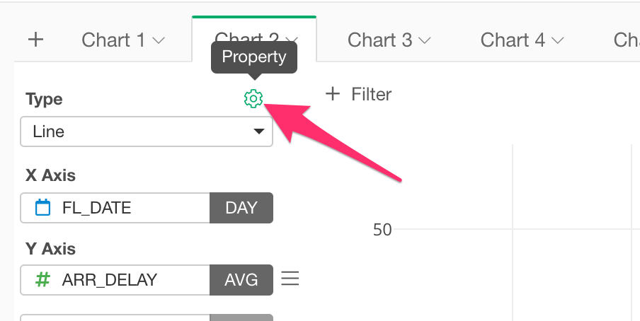

# Configure Layout and Format

You can configure the layout and format of the chart such as margins, font size or title on the Layout property dialog. You can access to the dialog by clicking "Layout" button at the top right corner of the chart. 

The dialog content changes depending on the chart type. See following for more detail. 

## Generic Charts

Generic Charts includes following chart types.  
* Bar 
* Line 
* Area 
* Histogram
* Boxplot
* Error Bar
* Heatmap 
* Contour 

Following layout properties are available for those type of charts. 

* Chart
  * Title - Title text
  * Font Size (numbers in pixel)
* X Axis 
  * Title - X Axis title text 
  * Title Font Size (numbers in pixel)
  * Tick Label Font Size (numbers in pixel)
  * Show Grid Lines 
    * Default - Depending on chart type 
    * On - Show explicitly
    * Off - Hide explicitly
  * Show Zero Lines 
    * Default - Depending on chart type 
    * On - Show explicitly 
    * Off - Hide explicitly
* Y Axis 
  * Title - Y Axis title text 
  * Title Font Size - Font size in pixel
  * Tick Label Font Size - Font size in pixel
  * Show Grid Lines 
    * Default - Depending on chart type 
    * On - Show explicitly 
    * Off - Hide explicitly
  * Show Zero Lines 
    * Default - Depending on chart type 
    * On - Show explicitly 
    * Off - Hide explicitly 
* Z Axis (Only available for Scatter charts with Z-Axis assigned) 
  * Title - Z Axis title text 
  * Title Font Size  (numbers in pixel)
  * Tick Label Font Size (numbers in pixel)
  * Show Grid Lines 
    * Default - Depending on chart type
    * On - Show explicitly
    * Off - Hide explicitly
  * Show Zero Lines 
    * Default - Depending on chart type
    * On - Show explicitly
    * Off - Hide explicitly 
* Margin 
  * Top  (numbers in pixel)
  * Left  (numbers in pixel)
  * Bottom  (numbers in pixel)
  * Right (numbers in pixel)
* Legend 
  * Position 
    * Right - Default
    * Left
    * Top 
    * Bottom 
    * None - Hide legend itself
  * Font Size - Font size for the legend text in pixel
* Plot Area 
  * Number of Decimal Digits - Number of decimal digits to round. 
  
## Maps

Maps includes following chart types.
* Map - Long/Lat  
* Map - Heatmap
* Map - GeoJSON

Following layout properties are available for those type of charts. 

* Map 
  * Type - Map type
    * Light 
    * Dark 
    * Streets
    * Streets Basic
* Plot Area 
  * Number of Decimal Digits - Number of decimal digits to round. 

## Pivot Table

Following layout properties are available for Pivot Table.

* Pivot 
  * Title - Title text
* Plot Area 
  * Number of Decimal Digits - Number of decimal digits to round. 
  * Value Width - Value cell width in pixel
  * Value Font Size - Font size for value cell text in pixel
  * Column Header Font Size - Font size for column header text in pixel
  * Text Wrap
    * No Wrap - Text will be hidden if it overflows
    * Wrap with Auto Column Width - Enable text wrap. Columns will expand automatically depending on the text size. 
    * Wrap with Fixed Column Width - Enable text wrap. Column width will be fixed. 
* Hide Data Cells - It shows only column headers if you enable it.

## Table 

* Table
  * Title - Title text
* Plot Area 
  * Number of Decimal Digits - Number of decimal digits to round. 
