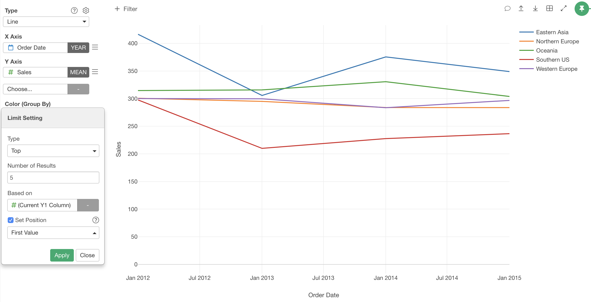

# Limit Values

The Limit Values feature literally limits/filters output of the categorical values by the conditions.

Limit Values is supported in the following chart types.

* Bar (X-Axis, Color, Repeat By)
* Line  (Color, Repeat By)
* Area (Color, Repeat By)
* Scatter (With Aggregation) (X-Axis, Y-Axis, Color, Repeat By, Group By)
* Boxplot (X-Axis, Color, Repeat By)
* Violin (X-Axis, Color, Repeat By)
* Histogram (Color, Repeat By)
* Density Plot (Color, Repeat By)
* Error Bar (X-Axis, Color, Repeat By)
* Map - Extension (Color)

## Overview

Suppose you have a Bar chart with a lot of bars. You may want to reduce the number of bars because there are too many bars and hard to compare. 

You can definitely create a filter to reduce bars. But, it is not straightforward to define a filter based on the aggregated values (in this case, the size of bars) such as "Showing top 30 bars". Limit Values provides a set of ways to filter categories based on the aggregated values by category. For example, you can get the top 30 of bars by just setting "Top" with "30" results.  

You can access Limit Value setting from the column menu.

## Types 

There are 3 Limit Value types.

### Condition 

You can define a condition against the aggregated values of each category to filter. For example, you can define "Bars that have more than 5,000 rows.".

Following options are available. 

* Based on: Values to compare. You can select a column that has values to compare and aggregation function. By default, it uses the same value column and its aggregation function used in the chart. You can also choose a different column and different aggregation function that is not even used in the chart. 
* Set Position: See below for deatil.
* Operator: The Operator of the condition. Following operators are available. 
    * equal to
    * not equal to
    * less than 
    * less than or equal to 
    * greater than 
    * greater than or equal to 
    * between 
    * not between 
* Value: Condition value 

#### Set Position

If you use "Condition" type, you need to specify a condition against the summarized value of the target group. But in some case, you want to point out value at a specific position in the group. 

For example, suppose you have a line chart with Color, and  you want to limit the colors that have "2887" at the last value. 

You can do it by checking the "Set Position" checkbox, selecting "Last Value" in the pulldown menu and setting "2887" at Value. 

The following positions are available. 
* First Value
* Last Value 

### Top

You can show only the number of categories that have the highest values. For example, you can define "Top 30 Bars".

Following options are available. 

* Number of Results: Number of categories to show. Default is 10.
* Based on: Values to compare. You can select a column that has values to compare and aggregation function. By default, it uses the same value column and its aggregation function used in the chart. You can also choose a different column and different aggregation function that is not even used in the chart. 

### Bottom

You can show only the number of categories that have the lowest values. For example, you can define "Bottom 30 Bars".

Following options are available. 

* Number of Results: Number of categories to show. Default is 10.
* Based on: Values to compare. You can select a column that has values to compare and aggregation function. By default, it uses the same value column and its aggregation function used in the chart. You can also choose a different column and different aggregation function that is not even used in the chart. 
