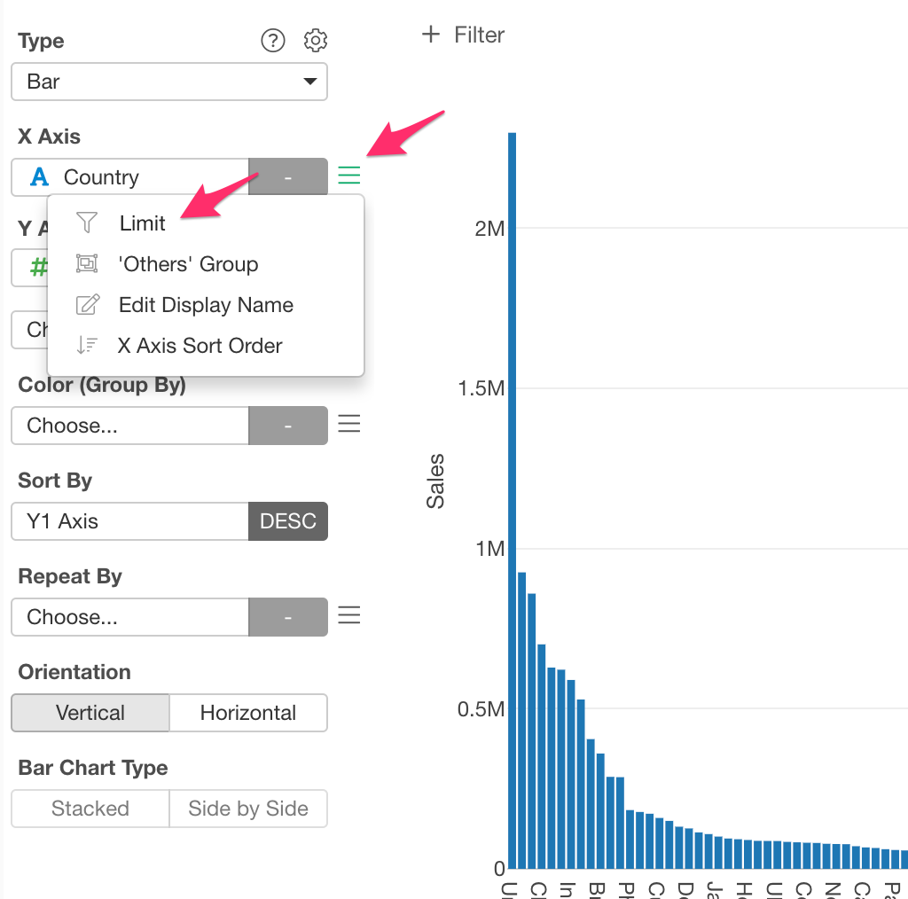

# Axis Formatting

Axis Formatting is available if you assign a Date or POSIXct column. 

Axis Foramtting is supported in the following chart types.

* Bar (X-Axis)
* Line (X-Axis)
* Area (X-Axis)

## Overview

Suppose you have a Bar chart with a lot of bars. You may want to reduce the number of bars because there are too many bars and hard to compare. 

You can definitely create a filter to reduce bars. But, it is not straightforward to define a filter based on the aggregated values (in this case, the size of bars) such as "Showing top 20 bars". Limit Values provides a set of ways to filter categories based on the aggregated values by category. For example, you can get the top 20 of bars by just setting "Top" with "20" results.  

You can access Limit Value setting from the column menu.

## Types 

There are 3 Limit Value types.

### Condition 

You can define a condition against the aggregated values of each category to filter. For example, you can define "Countires that have sales amount more than 500,000.".

Following options are available. 

* Based on: Values to compare. You can select a column that has values to compare and aggregation function. By default, it uses the same value column and its aggregation function used in the chart. You can also choose a different column and different aggregation function that is not even used in the chart. 
* Set Position: See [below](#set-position) for detail.
* Operator: The Operator of the condition. Following operators are available. 
    * equal to
    * not equal to
    * less than 
    * less than or equal to 
    * greater than 
    * greater than or equal to 
    * between 
    * not between 
* Value: Condition value 

### Top

You can show only the number of categories that have the highest values. For example, you can set 20 to show top 20 countries.

Following options are available. 

* Number of Results: Number of categories to show. 
* Based on: Values to compare. You can select a column that has values to compare and aggregation function. By default, it uses the same value column and its aggregation function used in the chart. You can also choose a different column and different aggregation function that is not even used in the chart. 

### Bottom

You can show only the number of categories that have the lowest values. For example, you can set 20 to show bottom 20 countries.

Following options are available. 

* Number of Results: Number of categories to show. 
* Based on: Values to compare. You can select a column that has values to compare and aggregation function. By default, it uses the same value column and its aggregation function used in the chart. You can also choose a different column and different aggregation function that is not even used in the chart. 

## Set Position

In the Limit setting for Color, you can set the position to compare and limit values. For example, if you have a Line chart showing Sales median values of each region and you want to show the top 5 region based on the last values. 

You can do it by checking the "Set Position" checkbox, selecting "Last Value". 

You can also pick the top 5 region based on the first values. 

You can select by selecting "First Value". 

The following positions are available. 
* First Value
* Last Value 
