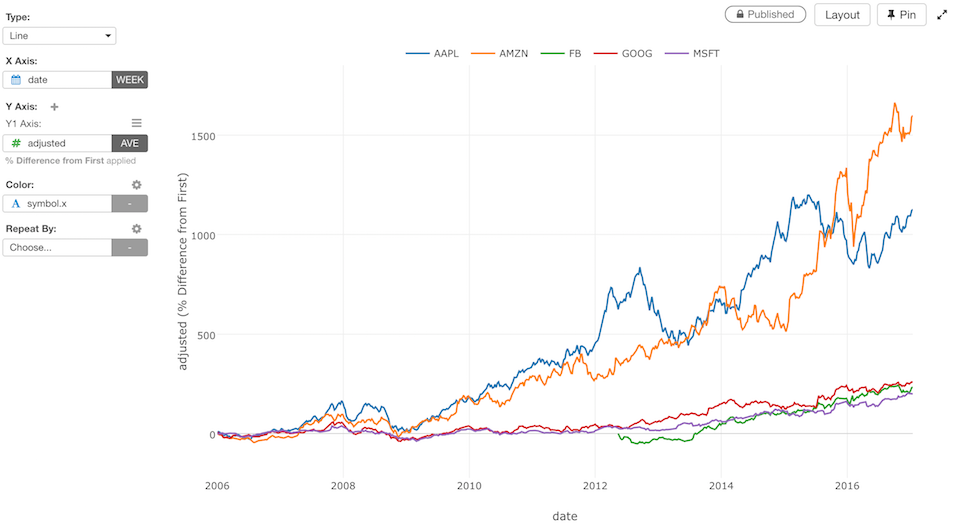

# Line Chart

## Column Assignments

* X-Axis - Assign a column you want to show at X-Axis. If it's a Date / Time column assigned, you can select the aggregation level such as `Month`, `Week`, `Day`, etc. If you assign a Number column, you can choose either `As Number` to treat values as continuous values or `As Text` to treat values as categorical values.  
* Y-Axis - Assign a column you want to show at Y-Axis. If it's a Numeric column assigned, you can set the aggregation function such as `Sum`, `Mean (Average)`, etc. to aggregate the values. You can also assign a Window Calculation from the Y-Axis properties. Look at [Window Calculation](window-calc.md) section for details.  
* Color - Take a look at [Color](color.md) section for more details.
* Sort - Assign a column to use for Sorting the X-Axis values. The default is based on either the alphabetic order or the factor level order for Factor type columns.
* Repeat By - You can assign a column to repeat the chart for each of its values. Take a look at [Repeat By](small-multiple.md) section for more details.

You can assign multiple columns to Y-Axis. Take a look at [Multiple Y-Axis](multi-y.md) section for more details.

## Marker Type

You can select one of marker types from the `Marker` menu of Y-Axis properties. Take a look at [Marker Type](marker.md) section for more details.

## Trend Line

Take a look at [Trend Line](trend-line.md) section for more details.

## Reference Line

Take a look at [Reference Line](reference-line.md) section for more details.

## Range

Take a look at [Range](range.md) section for more details.

## Highlight 

You can change the color of the specific markers such as bars, lines or circles that you pick to stand out from others. See [Highlight](highlight.md) for the detail. 

## Category 

You can categorize numeric values inside the chart. See [Category(Binning)](category.md) for the detail.

## Limit Values

You can use Limit Values to filter the categories by the aggregated values. See [Limit Values](limit.md) for the detail.

## Custom Function

You can use the Custom Function feature to define your own aggregation function. See [Custom Function](custom-function.md) for the detail.

## Missing Value Handling

You can use the Missing Value Handling feature to control missing values. See [Missing Value Handling](missing-value-handling.md) for the detail.

## Rename Column Names

You can use the Rename Column Names feature to update column names if you assign multiple columns to Y-Axis. See [Rename Column Names](rename-column-names.md) for the detail.

## Axis Setting

You can use the Axis Setting feature to assign columns to Y1/Y2 axes if you assign multiple columns to Y-Axis. See [Axis Setting](dualy-setting.md) for the detail.

## Layout Configuration

Take a look at [Layout Configuration](layout.md) on how to configure the layout and format. 
