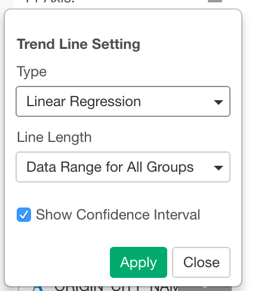
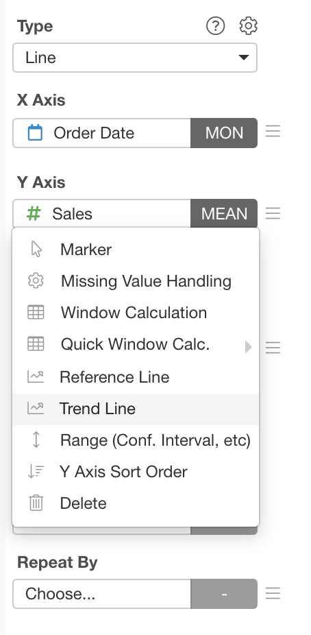
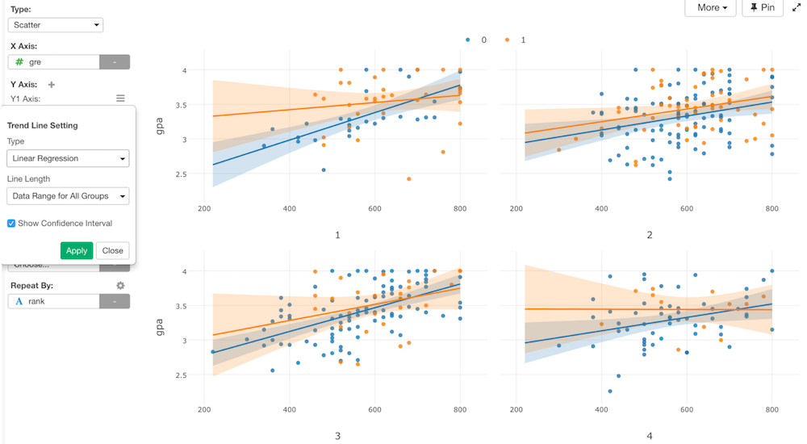
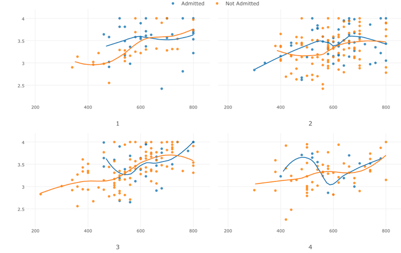
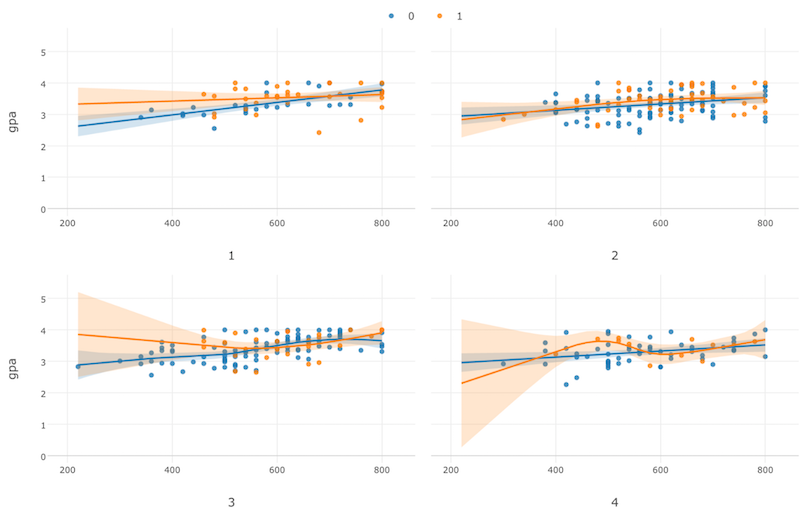
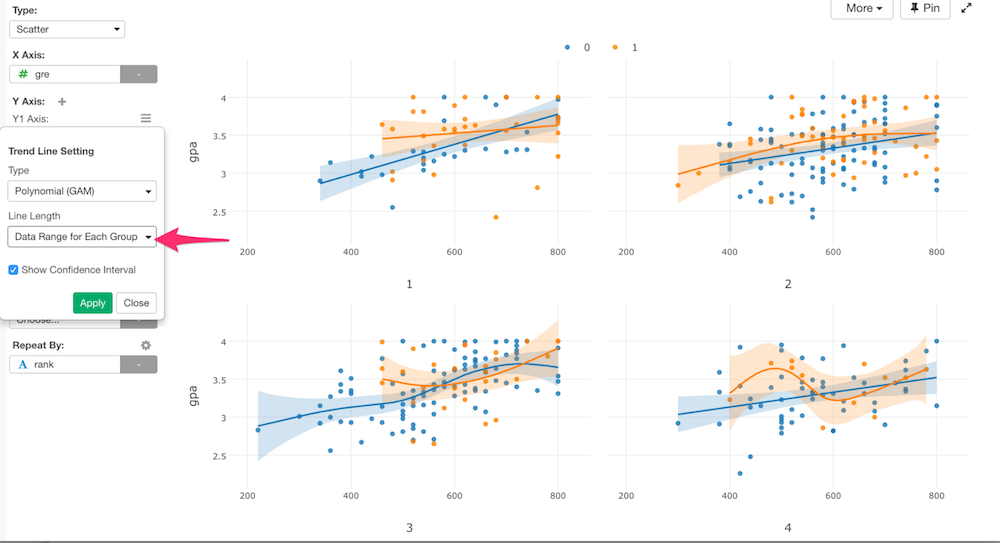
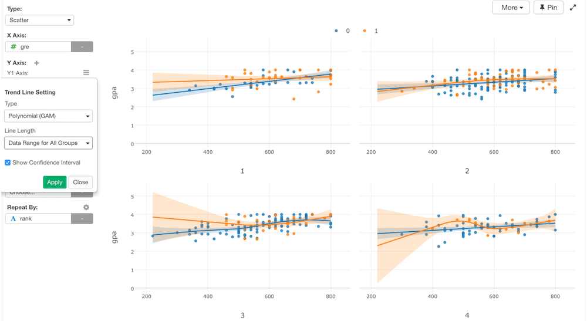

# Draw Lines Grouped By Labels

Trend Line feature is available for Scatter charts. You can draw Trend or Smooth Lines by selecting one of Trend Line types in the Trend Line Setting dialog. 

You can open this dialog by selecting `Trend Line` menu of Y-Axis properties. 

## Types

We support following 3 Trend Line types.

### Linear Regression  —  LM

This one uses Linear Regression (lm) internally and draw linear (straight) lines.

### Polynomial  —  Loess

This one uses Local Polynomial Regression (loess) internally to draw trend lines. It is the best to use when the data size is small. This option will be automatically disabled if the data size is more than 1000 for the performance reason.  

### Polynomial  —  GAM

This one uses Generalized Additive Model (GAM) internally to draw trend lines. It is the best to use when the data size is large.

## Options

* Line Length - You can select one of following options. 
  * Data Range for Each Group - It draws the trend lines and ranges only for the X-Axis range for each group of Color
  

  * Data Range for All Groups - It draws the trend lines and ranges for the entire chart area.  
  

* Show Confidence Interval - You can show/hide the confidence interval ranges. Default is checked. 
