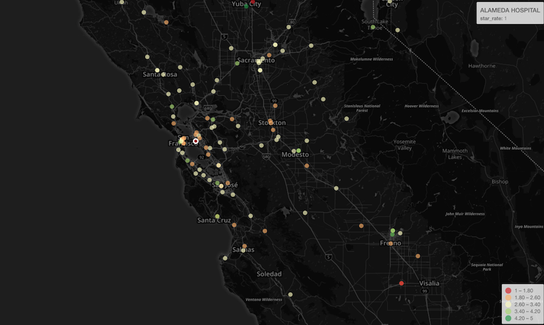
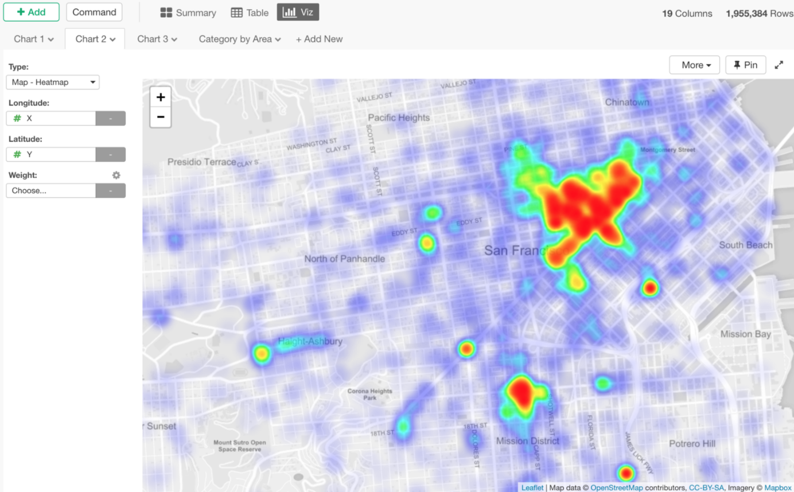

# Map

## Map with Longitude and Latitude

You can quickly visualize your geographical information on Map with longitude and latitude. Take a look at this quick post for more details.

* [Introduction to Map with Longitude and Latitude in Exploratory](https://blog.exploratory.io/introduction-to-map-with-longitude-and-latitude-in-exploratory-3716cbcd710)

## Map with Heatmap

When you have tons of location data points being displayed as dots on Map, it’s hard to understand the trend. This is when you want to consider using Heatmap on Map, which makes it easier to identify the trends or patterns of geographical data at glance.

## Map with GeoJSON / Shape

You can create your own GeoJSON map or install existing GeoJSON map extensions to show your geographical data on Map.
Take a look at this quick post for more details.

* [Using GeoJSON Map to Visualize US State Data Geographically](https://exploratory.io/note/kei/6949005180287436)

### How to Use GeoJSON Map?

#### Open GeoJSON Map Extension Dialog

In Viz view, you can click ‘Setup’ button after selecting ‘Map — GeoJSON’ chart type.

#### Find GeoJSON Map in Extensions Dialog inside Exploratory

Once you find the one you like, you can click ‘Install’ button, and now you are ready to start using it under Viz tab.

Once you find the one you like, you can click ‘Install’ button, and now you are ready to start using it under Viz tab.

#### Choosing a Key Property from GeoJSON

Each GeoJSON file provides a list of the properties that you can use to map with your data the way it works the best.

#### Mapping between GeoJSON’s key property and your data

The example below, I’m using ISO standard country codes found in the data and map them with ‘ISO_A2’ property of World Map GeoJSON.

### How to Create My GeoJSON?

Here's how you can create your own GeoJSON files from existing ESRI Shapefile or other formats using R.

* [Creating GeoJSON out of Shapefile in R](https://blog.exploratory.io/creating-geojson-out-of-shapefile-in-r-40bc0005857d)

## Layout Configuration

Take a look at [Layout Configuration](layout.md) on how to configure the layout and format. 

