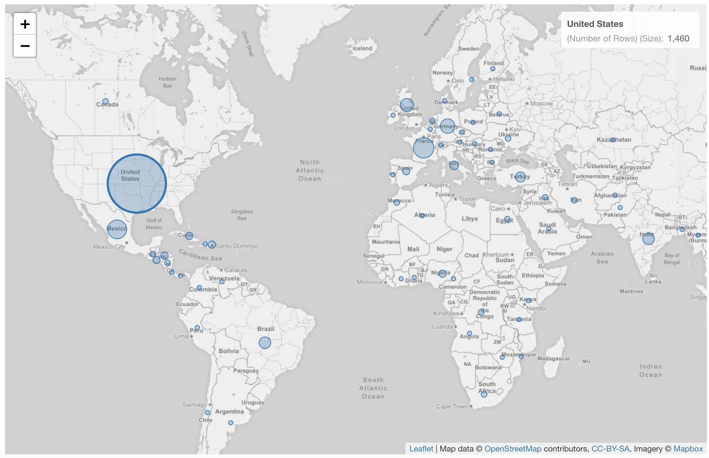
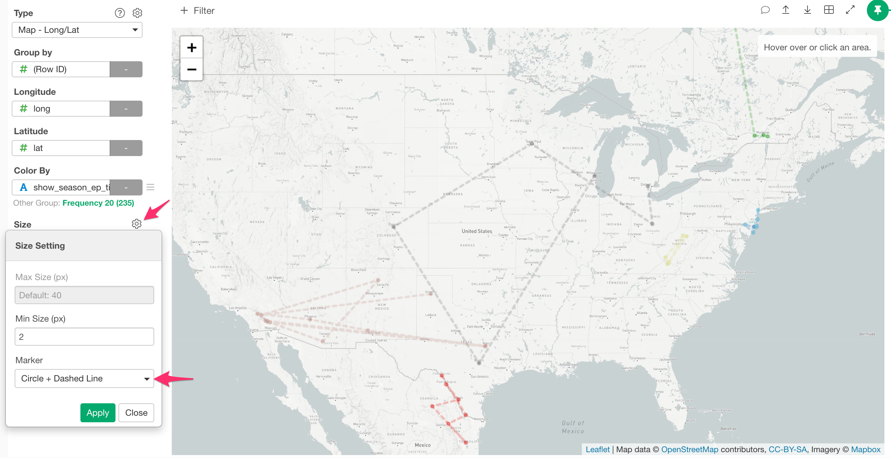
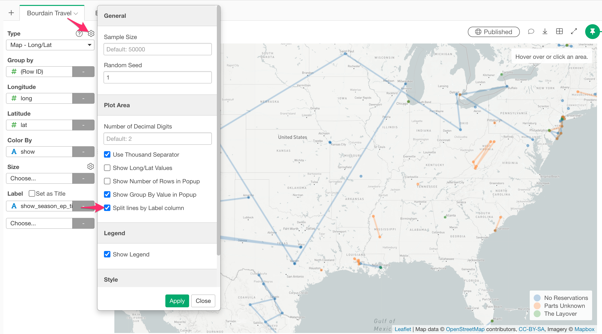

# Map - Long / Lat

You can quickly visualize your geographical information on Map with longitude and latitude. 

## Column Assignments

* Group by - Assign a column you want to group by.  
* Longitude - Assign a column that has longitude values. If you assign a column to Group By, you can choose how to aggregate such as sum, average. 
* Latitude - Assign a column that has longitude values. If you assign a column to Group By, you can choose how to aggregate such as sum, average. 
* Color By - Assign a column for color. If you assign a categorical column, it will be also used as a groupby column. Take a look at [Color](color.md) section for more details.
* Size - Assign a column for the circle size. 
* Label - Assign a column you want to show in the balloon help that you see when you hover circles on the map. 

## Highlight 

You can change the color of the specific circles that you pick to stand out from others. It is available only when you assgin a categorical column to color. See [Highlight](highlight.md) for the detail. 

## Category 

You can categorize numeric values inside the chart. See [Category(Binning)](category.md) for the detail.

## Missing Value Handling

You can use the Missing Value Handling feature to control missing values. See [Missing Value Handling](missing-value-handling.md) for the detail.

## Custom Function

You can use the Custom Function feature to define your own aggregation function. See [Custom Function](custom-function.md) for the detail.

## Connecting dots by lines

You can connect dots by lines by setting a marker to either "Circle + Line" or "Circle + Dashed Line". You can change the marker from the Size Setting dialog.

## Split lines by the Label column

You can split the lines even in the same color by setting a grouping column to the 'Label' and enabling the 'Split lines by Label column' option in the property. 

You can check out [the sample Map](https://exploratory.io/viz/kei/Map-Places-Anthony-Bourdain-Visited-for-His-Shows-with-Exploratory-6-4-6-wmr6gig4Jb). Try downloading and importing the EDF to your Exploratory Desktop to see how it works.  
