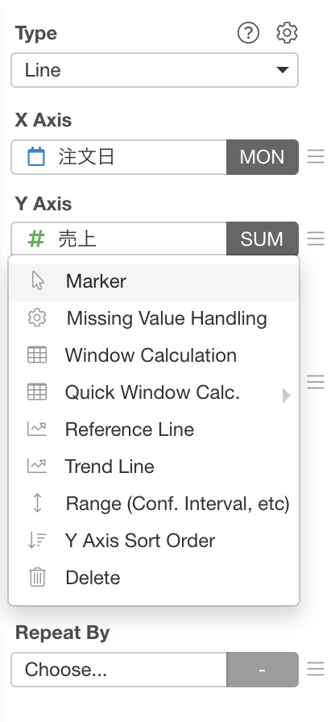
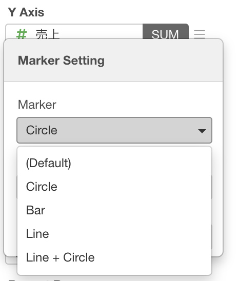

# Marker Type

In Line and Scatter (No Aggregation) charts, you can change the marker type for each Y-Axis from the Marker Setting dialog. You can access the dialog by selecting `Marker` menu from Y-Axis property dropdown.

 
You can select one of the following marker types. The default value is `(Default)` which follows the base chart type. If you select Line Chart, it will be Line. 

* (Default) - It shows the same markers as the base chart type. For example, if you select Line Chart, it will be Line.  
* Circle
* Bar
* Line
* Line + Circle

For Circle marker type, you can set the circle size. 

For the Line marker type, you can set the line width and line style. The following line style options are available.

* Solid 
* Dot
* Dash
* Long Dash
* Dash and Dot
* Long Dash and Dot

If you have multiple Y-Axises defined, you can set marker type for each Y-Axis independently so that you can mix different marker types in the same chart. For example, you can set `Line` marker for Y1-Axis, and `Circle` for Y2-Axis.  

