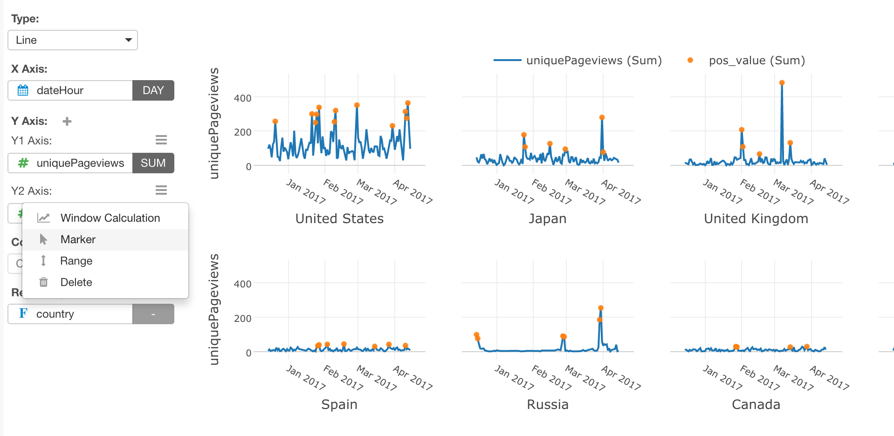

# Marker Type

You can select one of the following marker types from the `Marker` menu of Y-Axis properties. The default value is `(Default)` which follows the base chart type. If you select Line Chart, it will be Line. 

* (Default) - It shows the same markers as the base chart type. For example, if you select Line Chart, it will be Line.  
* Line
* Circle
* Bar

