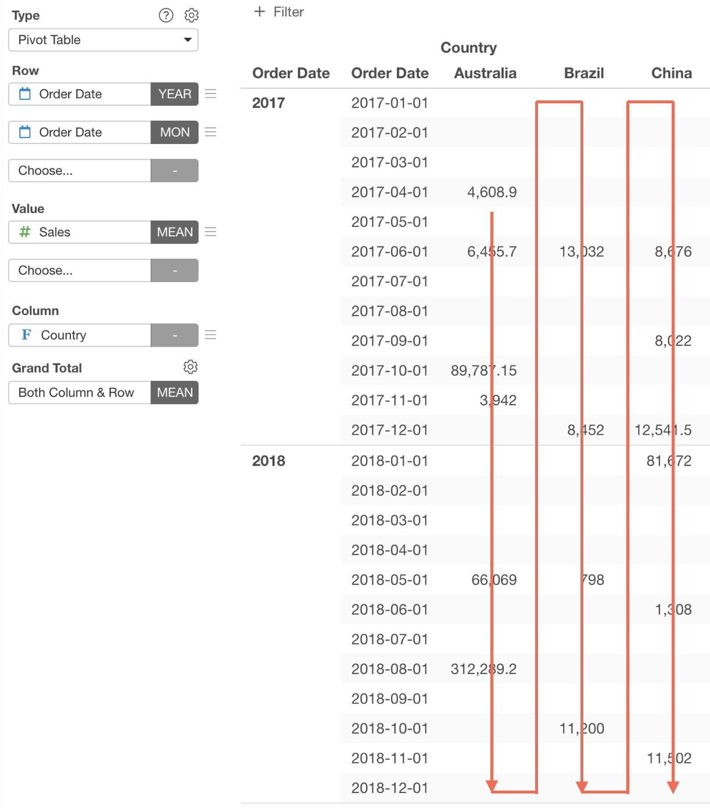
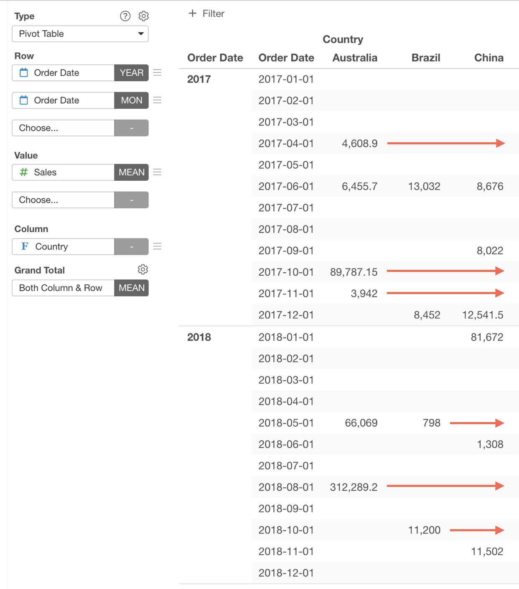
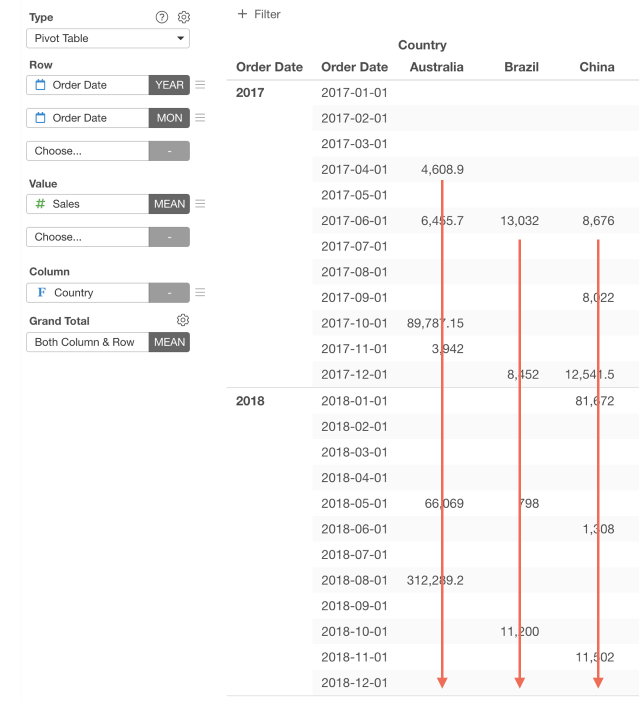
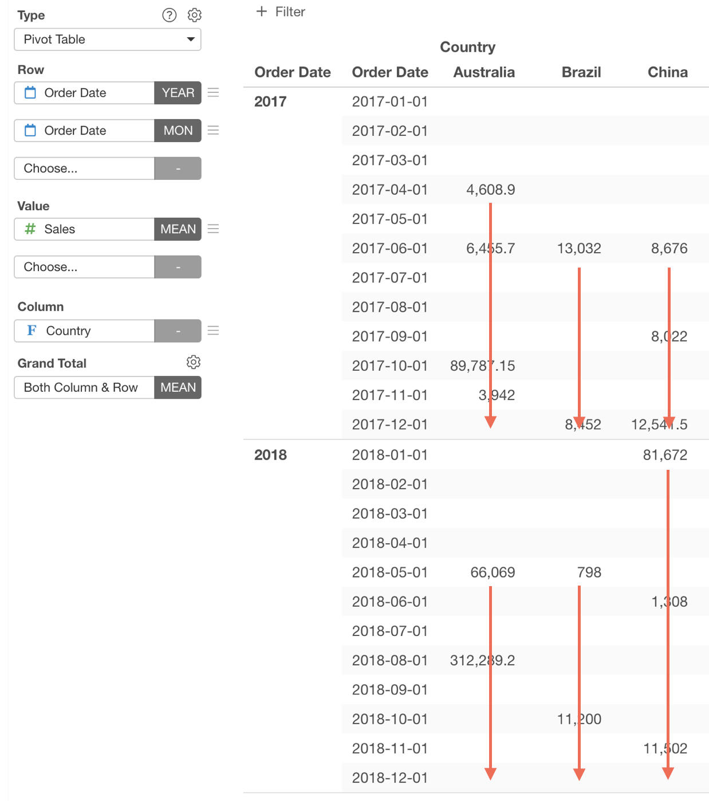
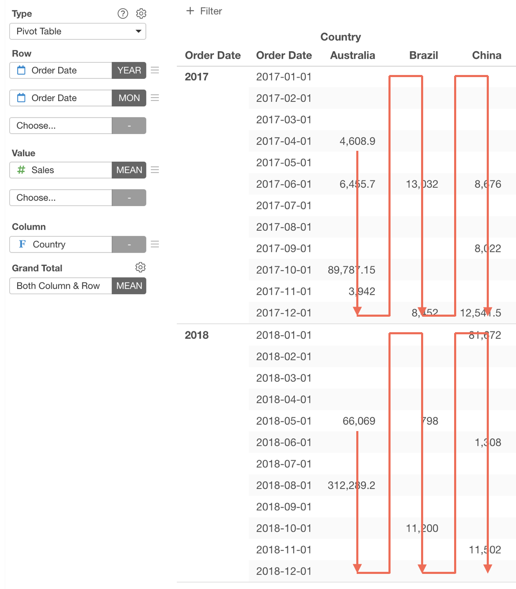

# Missing Value Handling

Missing Value Handling is available in the following charts. 

* Bar
* Line
* Area
* Pie / Ring
* Histogram
* Density Plot
* Boxplot
* Violin Plot
* Error bar
* Error Bar (Summarized Data)
* Map - Long/Lat 
* Pivot Table 
* Summarize Table 

## Show Unused Factor Levels

You can set to show or hide the unused factor levels.

## Missing Value Hanling 

### Type

You can set how to fill the missing value at the "Missing Value Handling" option. This option is available in the following chart types.

* Bar - Y-Axis
* Line - Y-Axis
* Area - Y-Axis
* Scatter (With Aggregation) - Y-Axis
* Pivot Table - Value
* Summarize Table - Value

The following options are available. 

* None 
* Fill with NA 
* Fill with Zero
* Fill with Previous Value First, then Next Value (Only available in Pivot Table and Summarize Table)
* Fill with Previous Value
* Fill with Next Value
* Fill with Next Value First, then Previous Value (Only available in Pivot Table and Summarize Table)

Here are examples of how each option works. Suppose you have Sales data but it misses the data for year 2013 except USCA. 

#### None 

No filling happens. If you use a Line chart, It just connects the values. This is the default behavior.

#### Fill with NA 

It fills missing values with NAs. If you use a Line chart, lines will be intermittent.

#### Fill with Zero

It fills missing values with zeros.

#### Fill with Previous Value

It fills missing values with the previous values.

#### Fill with Next Value

It fills missing values with the next values.

### Direction 

You can select the direction how you fill the missing values. The following options are available.  This option is available only in Pivot Table and Summarize Table.

* All (Down then Across)

* Row (Across)

* Column (Down)

* Column (Down within Group)

* Column (Down then Across within Group)

### Range to Fill Through

For the "Fill with Previous Value" and "Fill with Next Value" options, you have the "Range to Fill Through" option. The following options are available.

* End of Each Group - Value filling happens within each group (Color and Repeat By) range. 
* End of All - Value filling happens for the whole data range. 
