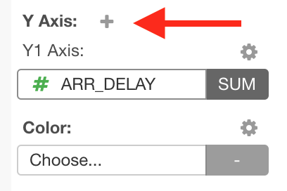
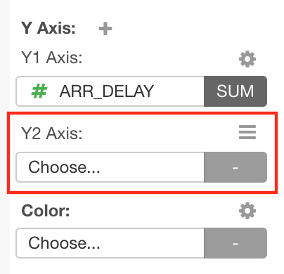

# Multiple Y-Axis

The Multiple Y-Axis feature is available on Bar, Line, Area and Scatter charts. You can assign multiple columns to Y-Axis on those charts. 

## How to Add Y-Axis

For charts that support Multiple Y-Axis, you see the plus ("+") sign right next to the "Y Axis:" label.   
  

You can click that plus sign to add another Y-Axis to the chart. 

You can click more to add more Y-Axises up to 5. 

## How to Remove Y-Axis
 
You can remove unnecessary Y-Axis by clicking the dropdown menu from on the target Y-Axis and selecting `Delete` item. 
 

 
Note that you cannot remove Y1-Axis. 

## Color 

You cannot assign multiple columns to Y-Axis and a column for Color at the same time. As soon as you assign multiple columns to Y-Axis, the column assignment for Color will be removed if there's any, and Color control will be disabled. 

But you can still change the color scheme from the Color dialog. See [Color](color.md) section for the detail about Color. 
