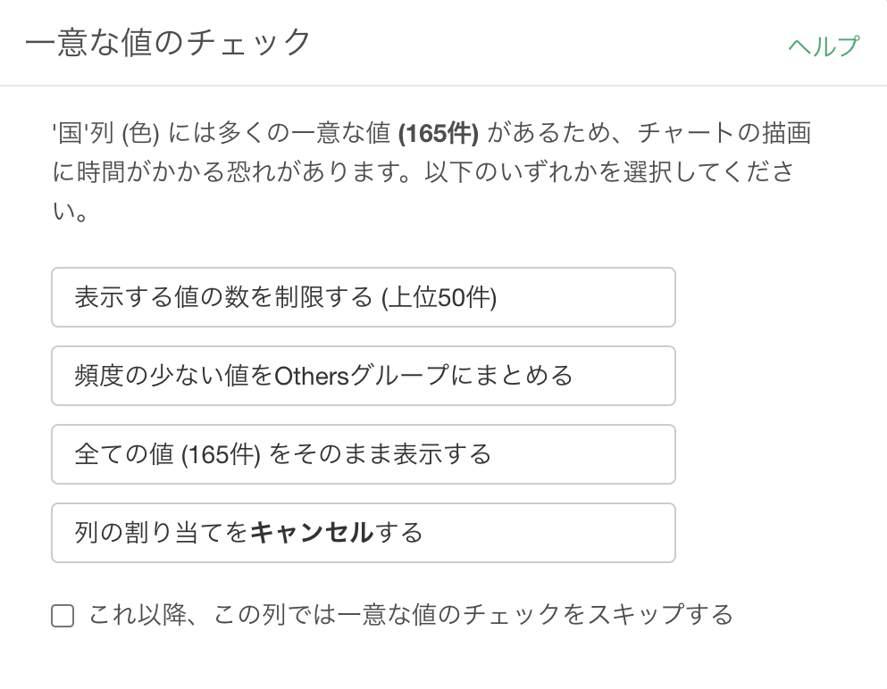

# 一意な値のチェック

多くの一意な値がある列をチャートの軸、色、繰り返しなどに割り当てた場合、チャートの描画速度が遅くならないようにするために、一意な値をどのように扱うかというダイアログが表示されます。以下のいずれかの選択肢を選ぶことができます。

* 表示する値の数を制限する
* 頻度の少ない値をOthersグループにまとめる
* 全ての値をそのまま表示する
* 列の割り当てをキャンセルする

「全ての値をそのまま表示する」を選択すると、一意の値の数によって、チャートの描画に時間がかかる場合があります。

## 一意な値のチェックをスキップする

「全ての値をそのまま表示する」を選択した場合、チャートの他の部分を変更するたびに、同じダイアログが毎回表示されるようになります。このダイアログを表示したくない場合は、「これ以降、この列では一意な値のチェックをスキップする」のチェックボックスをチェックしてから、「全ての値をそのまま表示する」ボタンをクリックしてください。

このチェックボックスの設定は、違う列を選ぶと解除されます。

