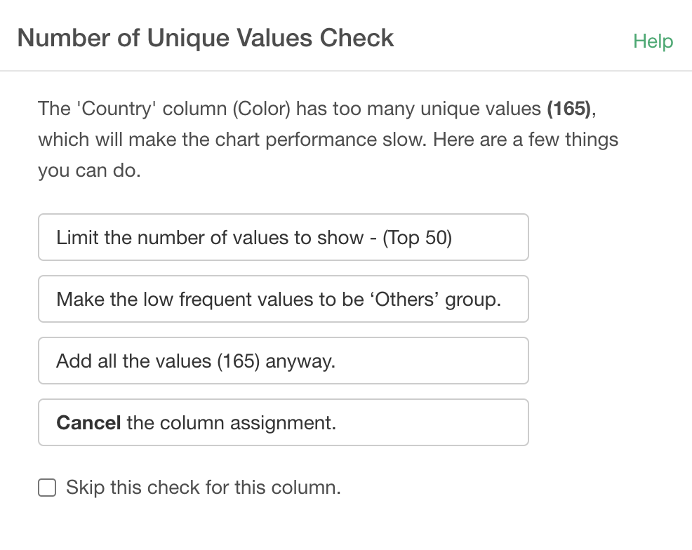

## Number of Unique Values Check

If you assign a column with many unique values ​​to a chart X-Axis, Color, Repeat By, etc., you will see the "Number of Unique Values Check dialog. This for protecting your chart from slowing down the rendering speed. You can choose one of the following options for how to handle the unique values.

* Limit the number of values to show
* Make the low frequent values to be 'Others' group
* Add all the values anyway
* Cancel the column assignment

If you choose "Add all the values anyway" option, it may slow down your chart depending on how many unique values you have in the column.

## Skipping the Number of Unique Values Check

If you select "Add all the values anyway", the same dialog will be displayed every time you change other parts of the chart. If you don't want to see this dialog, check the "Skip this check for this column" checkbox, then click the "Add all the values anyway" button.

The setting of this check box will be canceled if you assign a different column.

