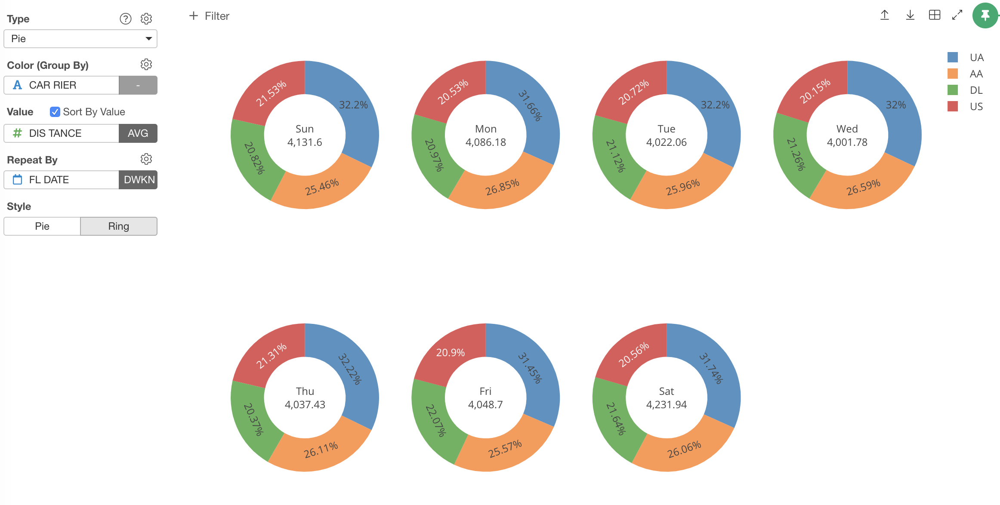

##  Pie / Ring Chart

You can visualize the ratio of the data in pie/ring shapes. It is suitable to compare the ratios among the groups.  

## Column Assignments

* Color - Assign a column for groups. Take a look at [Color](color.md) section for more details.
* Value - Assign a data column you want to visualize and compare. The column data should be numeric. 
* Sort By Value - If you check it, the color sort is based on the size of the values. If you uncheck it, the color sort is based on the data. If you assign a character column, it will be in an alphabetical order. If you assign a factor column, the order will be in the factor level order. 
* Repeat By - You can assign a column to repeat the chart for each of its values. Take a look at [Small Multiple](small-multiple.md) section for more details.
* Style - You can choose Pie or Ring style. 

## Layout Configuration

* Show Percentages 
* Show Values 
* Show Labels 
* Hole Size 

Take a look at [Layout Configuration](layout.md) on how to configure the layout and format. 
