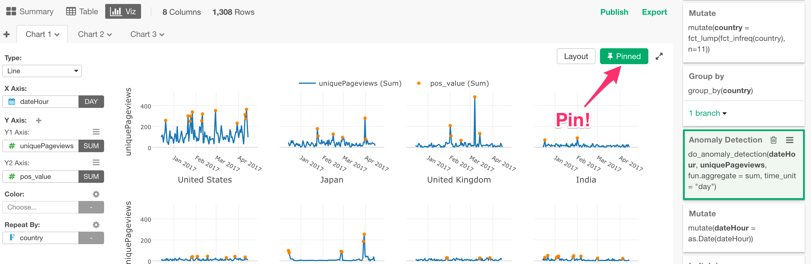

# Chart Pinning

You can click on 'Pin' button at the right-hand side top to pin the chart to the currently selected data transformation step at the right-hand side.

This makes the chart always show the data from the 'Pinned' step. This is convenient when you don't want the chart to move steps while you are updating other steps.

Take a look at this post for more details.

* [An Introduction to Chart Pinning in Exploratory](https://blog.exploratory.io/introduction-to-chart-pinning-in-exploratory-be5f1eba6649)
