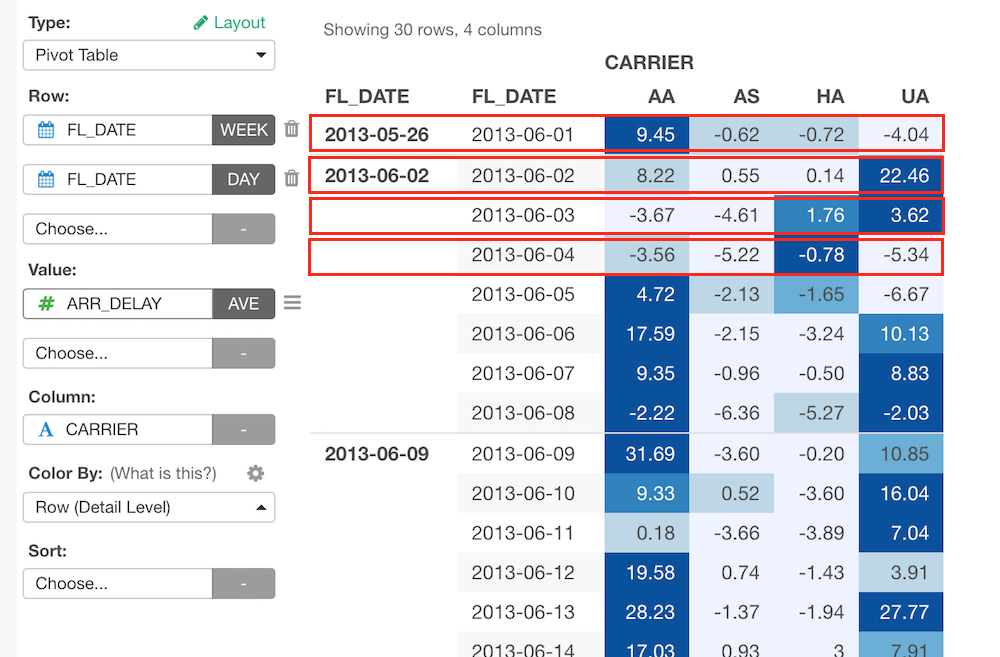
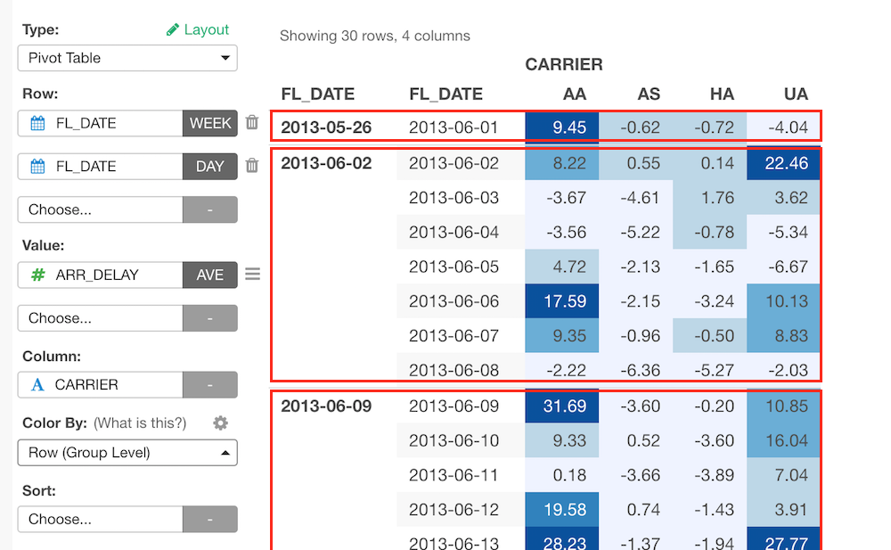
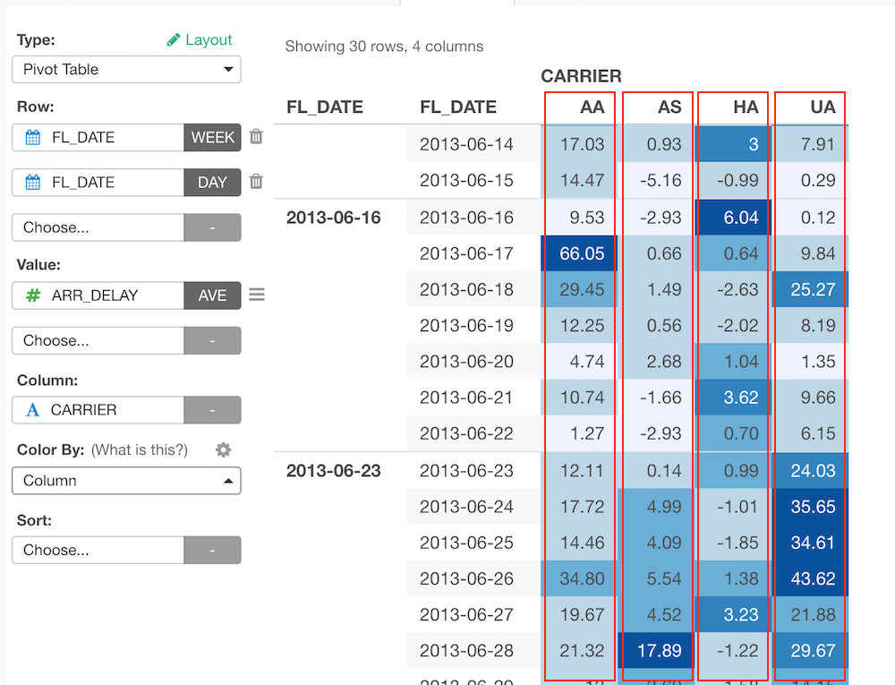
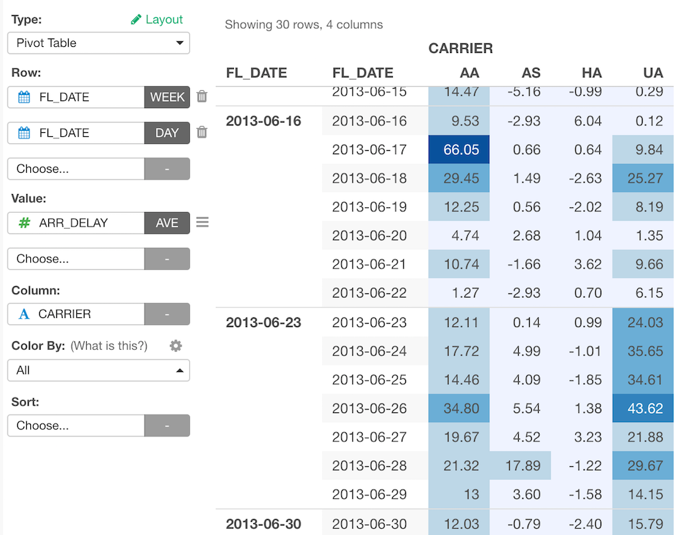
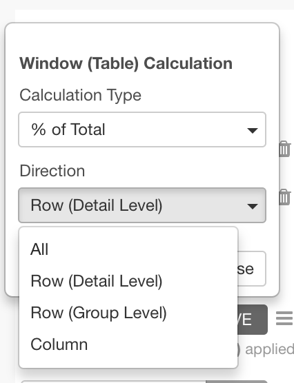

# Pivot Table

Pivot Table makes it super easy to not only summarize (aggregate) data but also spot outliers or patterns quickly by using color. And, just like any other visualization (chart) types you can share it with reproducible data preparation steps simply by clicking a button and start having a conversation around the data.

## Column Assignments

* Row - Assign a column you want to show at Row Headers. If it's a Date / Time column assigned, you can select the aggregation level such as `Month`, `Week`, `Day`, etc. You can assign multiple columns to Row.   
* Value - Assign a column you want to show at the value area. If it is a numeric column assigned, you can set the aggregation function such as `Sum`, `Mean (Average)`, etc. to aggregate the values. If it is non-numeric column, you can set the count based aggregation function such as `Count (number of rows)`, `Number of Unique Values`, etc. You can assign multiple columns to Value. You can also assign a Window Calculation for each Value from the gear icon on each Value. Look at the Percent (%) of Total section below for detail.  
* Column - Assign a column you want to show at Column Headers. If it's a Date / Time column assigned, you can select the aggregation level such as `Month`, `Week`, `Day`, etc.
* Sort - Assign a column to use for Sorting the Row values. The default is based on either the alphabetic order or the factor level order for Factor type columns.

## Color By

You can use "Color By" to format the Value cells with colors based on the Values, which would make it easier to spot the patterns or trends in the data. The formatting is based on the value range of each target group. Basically what it does is, it figures out the value range based on min and max values, splits the range into 5 equal length, and applies the color palettes. Following target group options are available. 

#### Row (Detail Level)

It formats Value cells for each row. 

#### Row (Group Level)

It formats Value cells for each row group, which means the 2nd Row Header group from the right.  

#### Column

It formats Value cells for each column. 

#### All

It formats Value cells for the entire pivot table. 

You can change the color palette and reverse the order of the color assignment by clicking a gear icon.

If you assign multiple columns to Value, the Color By options applies to all the columns.   

If you assign the "Percent of Total" window function on any Value column, the Color By option will be available only for the direction selected at the "Percent of Total". See the "Percent of Total" section following for details.

## Percent (%) of Total

The "Percent of Total" calculates the ratio of values for each group (direction). You can assign "Percent of Total" by clicking the gear icon on each column assigned to Value, selecting "Window Function" menu item and choosing it from the "Calculation Type".   

Following direction options are available.

#### Row (Detail Level)

The ratio calculation is done for each row. 

#### Row (Group Level)

The ratio calculation is done for each row group, which means the 2nd Row Header group from the right.  

#### Column

The ratio calculation is done for each column. 

#### All

The ratio calculation is done for the entire pivot table. 

If you assign multiple columns to Value, the Color By options applies to all the columns assigned.   

If you assign the "Percent of Total" window function on any Value column, the Color By option will be available only for the direction selected at the "Percent of Total". 

## Visual Sort 

You can sort by the column by clicking the column header. Note that the sort happens only for the rows fetched. 

## Category 

You can categorize numeric values inside the chart. See [Category(Binning)](category.md) for the detail.

## Layout Configuration

Take a look at [Layout Configuration](layout.md) on how to configure the layout and format. 

## Links

You can check out the following articles for more information. 

* [Introducing Pivot Table](https://blog.exploratory.io/introducing-pivot-table-1c9c949fd2d6#.vxc6ndj8u)

* [Percent of Total support (3.0 Release)](https://blog.exploratory.io/exploratory-v3-0-released-ace2a16e7d91)
