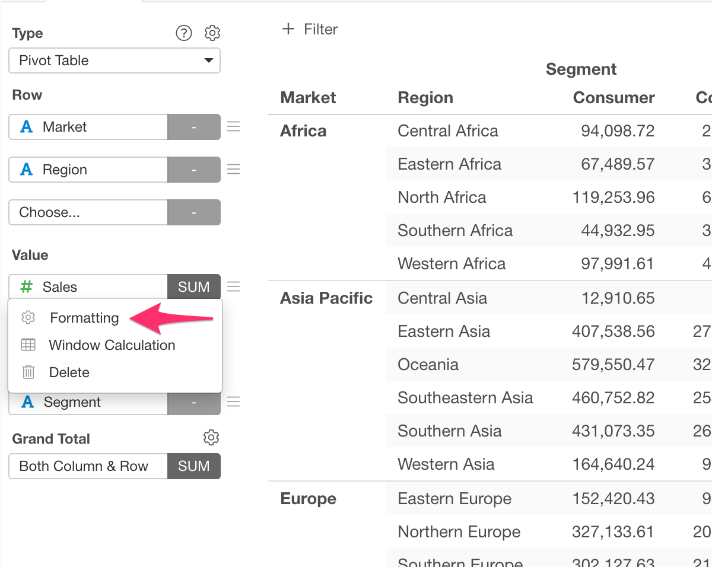
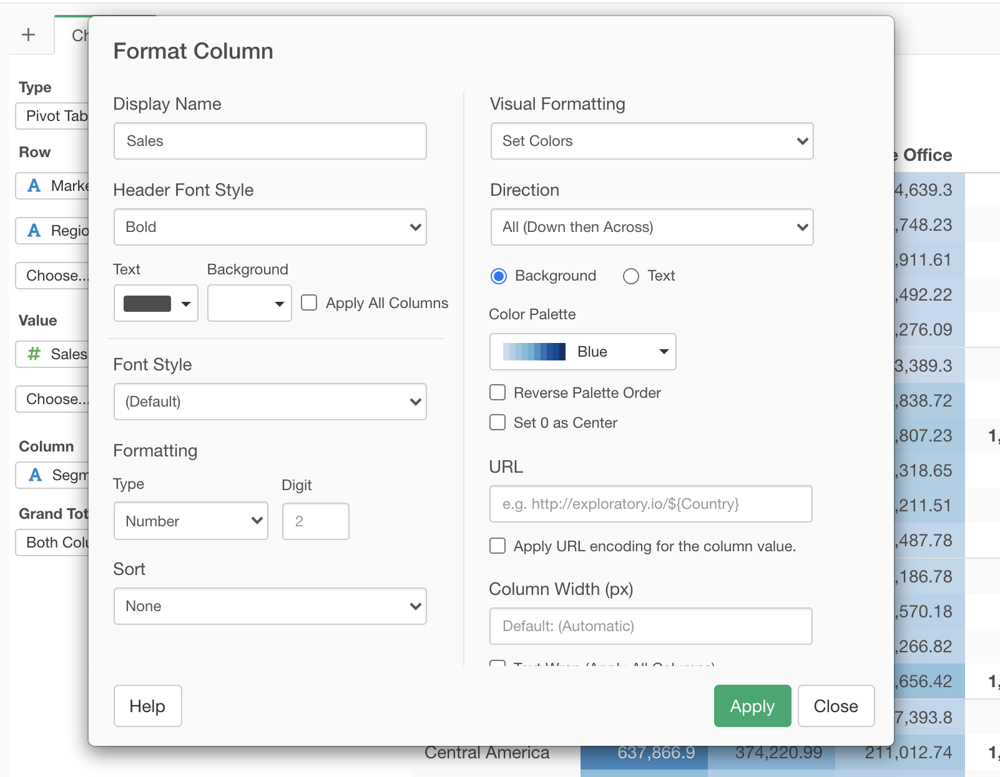

# Pivot Table

Pivot Table makes it super easy to not only summarize (aggregate) data but also spot outliers or patterns quickly by using color. And, just like any other visualization (chart) types you can share it with reproducible data preparation steps simply by clicking a button and start having a conversation around the data.

## Column Assignments

* Row - Assign a column you want to show at Row Headers. If it's a Date / Time column assigned, you can select the aggregation level such as `Month`, `Week`, `Day`, etc. You can assign multiple columns to Row.   
* Value - Assign a column you want to show at the value area. If it is a numeric column assigned, you can set the aggregation function such as `Sum`, `Mean (Average)`, etc. to aggregate the values. If it is non-numeric column, you can set the count based aggregation function such as `Count (number of rows)`, `Number of Unique Values`, etc. You can assign multiple columns to Value. You can also assign a Window Calculation for each Value from the gear icon on each Value. Look at the Percent (%) of Total section below for detail.  
* Column - Assign a column you want to show at Column Headers. If it's a Date / Time column assigned, you can select the aggregation level such as `Month`, `Week`, `Day`, etc.
* Sort - Assign a column to use for Sorting the Row values. The default is based on either the alphabetic order or the factor level order for Factor type columns.

## Formatting Columns

You can format each Row Header and Value column. You can access the Column Format dialog by selecting "Formatting" menu in the column menu next to the column name dropdown. See 
[Column Configuration Dialog](column-configuration-dialog.md) for mode details.

## Window Calculation 

* You can assign Window Calculations for each column at Value. See [Window Calculation](window-calc.md) for more details.

## Visual Sort 

You can sort by the column by clicking the column header. Note that the sort happens only for the rows fetched. 

## Category 

You can categorize numeric values inside the chart. See [Category(Binning)](category.md) for the detail.

## Custom Function

You can use the Custom Function feature to define your own aggregation function at Value. See [Custom Function](custom-function.md) for the detail.

## Calculation Target for Total Calculation

You can choose how to calculate the totals/subtotals at the Calculation Target in the Setting dialog for total.

* Data After Aggregation: Totals and subtotals are calculated based on the cell values in the Pivot Table which are already aggregated. 
* Data Before Aggregation: Totals and subtotals are calculated based on the raw data before any aggregations. 

## Layout Configuration

Take a look at [Layout Configuration](layout.md) on how to configure the layout and format. 

