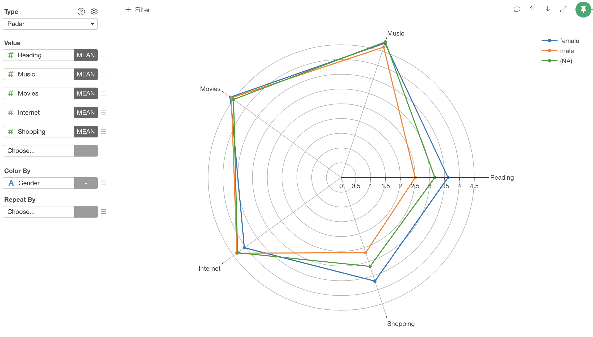

# Radar Chart

## Column Assignments

* Value - Assign columns containing values that you want to show on the radar. You need at least 3 columns to render a Radar chart. You can assign any type of columns. You need to assign an aggregation function to calculate a value that represents each column. 
* Color By - You can draw radars for each of its values. Take a look at [Color](color.md) section for more details.
* Repeat By - You can assign a column to repeat the chart for each of its values. Take a look at [Repeat By](small-multiple.md) section for more details.

## Category 

You can categorize numeric values inside the chart. See [Category(Binning)](category.md) for the detail.

## Start Position

You can set the starting point of the radar. The following options are available. 

* Top (Default)
* Bottom
* Left
* Right 

## Limit Values

You can use Limit Values to filter the categories by the aggregated values. See [Limit Values](limit.md) for the detail. 

## 'Others' Group

If you have many categories, you can reduce the number of categories by changing some category names to 'Others' using the 'Others' Group feature. See ['Others' Group](others-group.md) for the detail. 

## Rename Column Names

You can use the Rename Column Names feature to update column names if you assign multiple columns to Value. See [Rename Column Names](rename-column-names.md) for the detail.

## Show Detail

You can show the detailed data underlying the chart by clicking the chart figure. See [Show Detail](show-detail.md) for the detail.

## Layout Configuration

Take a look at [Layout Configuration](layout.md) on how to configure the layout and format. 

## Save as an Image

You can save the chart as an image file. See [Save as PNG/SVG](save.md) for more details.
