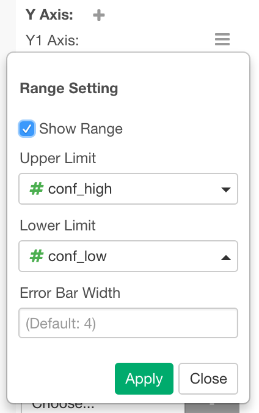
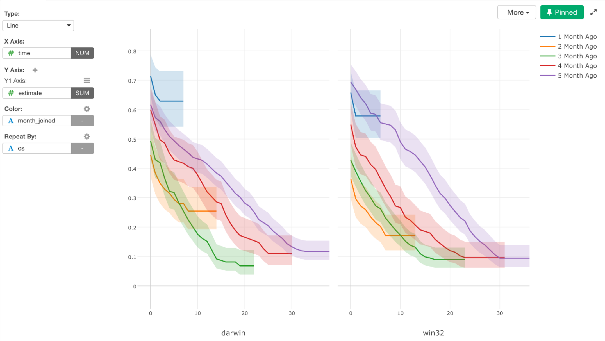
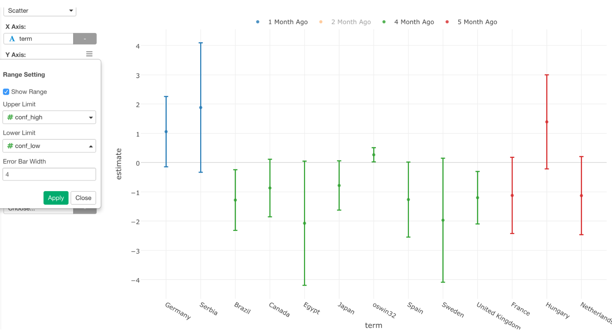

# Range

If you have upper and lower limit values for the values on Y-Axis such as confidence intervals, you can show them as ranges in the same chart. You can assign them at the `Range` menu of Y-Axis properties.

Columns for upper and lower values will be automatically picked and assigned when you click `Show Range` checkbox if you have one of following column pairs in the same data frame. 

* `(Y-Axis Column Name)_high` and `(Y-Axis Column Name)_low`
* `(Y-Axis Column Name).high` and `(Y-Axis Column Name).low`
* `(Y-Axis Column Name)_upper` and `(Y-Axis Column Name)_lower`
* `(Y-Axis Column Name).upper` and `(Y-Axis Column Name).lower`
* `(Y-Axis Column Name)_higher` and `(Y-Axis Column Name)_lower`
* `(Y-Axis Column Name).higher` and `(Y-Axis Column Name).lower`
* `conf_high` and `conf_low`
* `conf.high` and `conf.low`

## Range on Line Chart

If you assign Upper and Lower Limit of the range in the Line Chart, it shows the range band for each line. 

## Range on Scatter Chart

If you assign Upper and Lower Limit of the range in the Scatter Chart, it shows the error bar on each circle. 

