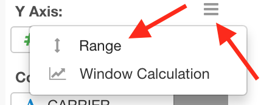

# Range

The Range feature is available in Line and Scatter (No Aggregation) charts. If you have upper and lower limit values for the values on Y-Axis such as confidence intervals, you can show them as ranges in the same chart. 

You can control the Range setting on the Range Setting dialog. You can open the Range Setting dialog by clicking `Range` from Y-Axis dropdown menu.

You can enable the Range by checking the `Show Range` checkbox. Then you can assign columns for Upper Limit values and Lower Limit values. 

Columns will be automatically picked and assigned for your convenience if you have one of following column pairs in the same data frame. 

* `(Y-Axis Column Name)_high` and `(Y-Axis Column Name)_low`
* `(Y-Axis Column Name).high` and `(Y-Axis Column Name).low`
* `(Y-Axis Column Name)_upper` and `(Y-Axis Column Name)_lower`
* `(Y-Axis Column Name).upper` and `(Y-Axis Column Name).lower`
* `(Y-Axis Column Name)_higher` and `(Y-Axis Column Name)_lower`
* `(Y-Axis Column Name).higher` and `(Y-Axis Column Name).lower`
* `conf_high` and `conf_low`
* `conf.high` and `conf.low`

## Range on Line Chart

If you assign Upper and Lower Limit of the range in the Line Chart, it shows the range band for each line. 

## Range on Scatter (No Aggregation) Chart

If you assign Upper and Lower Limit of the range in the Scatter (No Aggregation) chart, it shows the error bar on each circle. 

You can optionally set the Error Bar Width at the Range Setting dialog. The default width is `4` in pixel.
