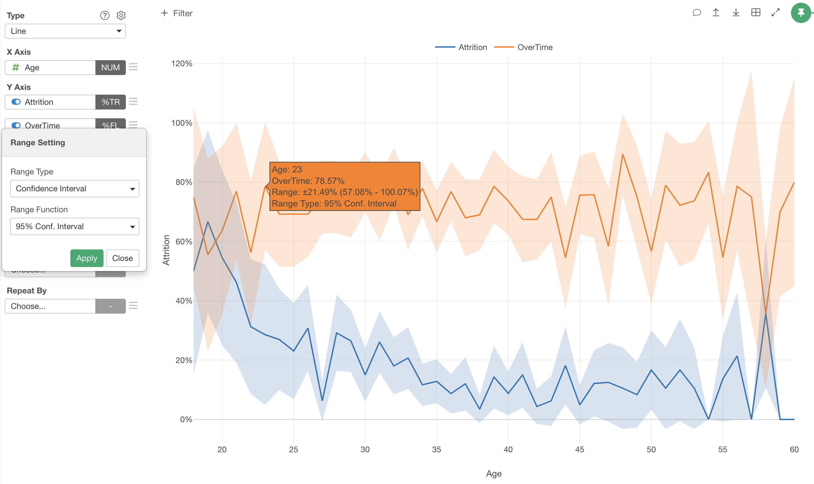
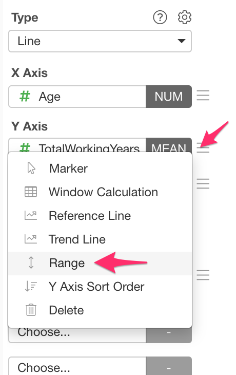
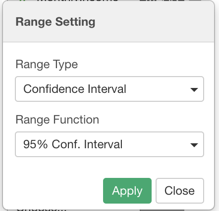
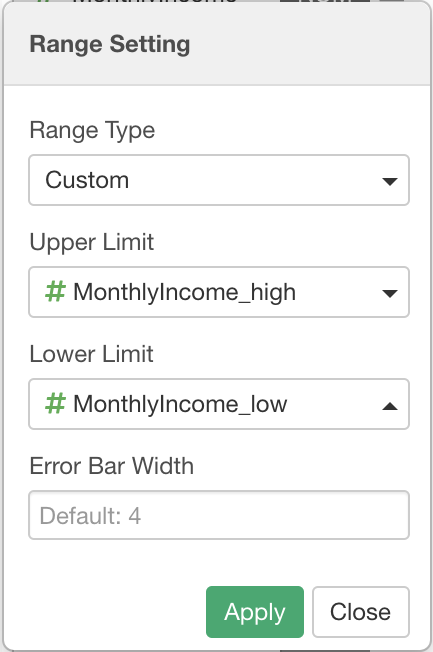
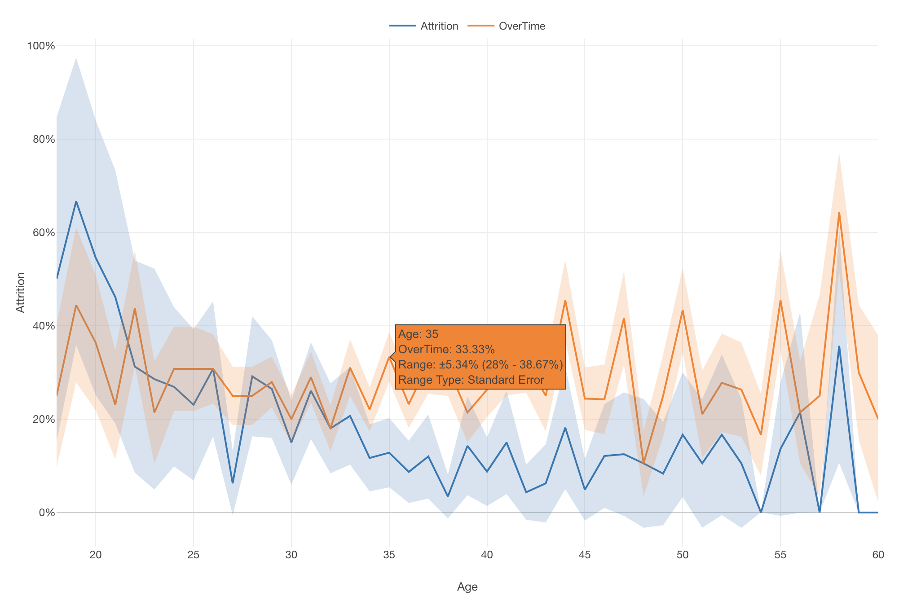
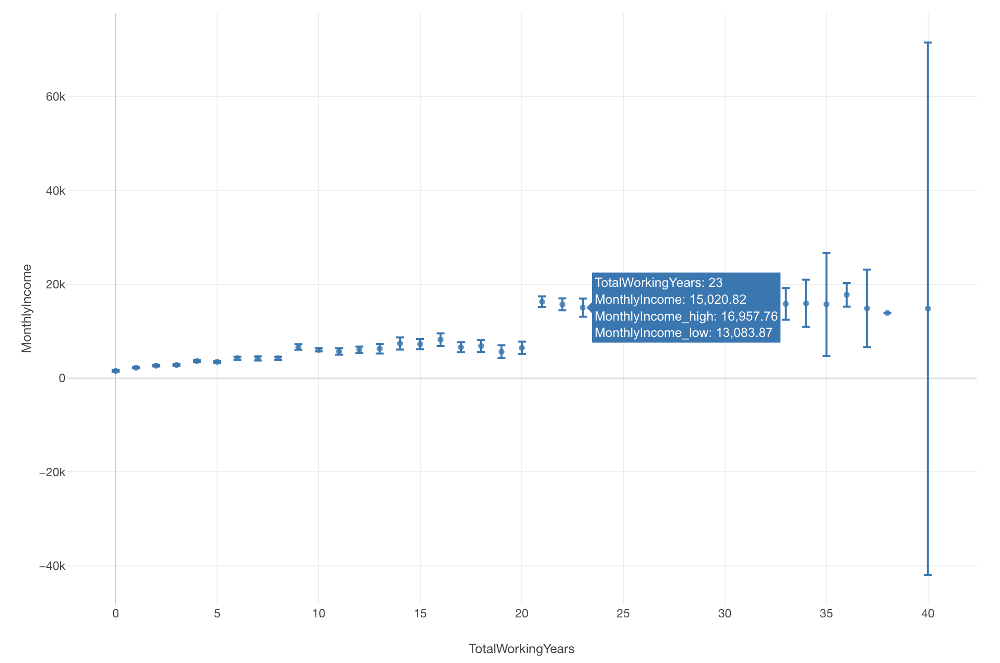

# Range

The Range feature enables you to show additional range information on a chart. It is available in Line and Scatter (No Aggregation) charts. 

## Setup the Range 

You can set up the range from the Range Dialog. You can find the Range Dialog in the Y-Axis menu dropdown.

## Range Types

There are 2 range types available. 

* Confidence Interval
* Custom

### Confidence Interval 

The Confidence Interval option calculates confidence interval ranges from data and shows them automatically on a chart. You can show confidence interval ranges by selecting the "Confidence Interval" from the Range Type menu in the Range Setting Dialog. 

There are the following options available for Range Function.

* 95% Condfidence Interval
* 99% Condfidence Interval
* Standard Error

Note that Confidence Interval is available only in Line chart, and is available for Mean, % of TRUE, and % of FALSE functions without Window Calculation being applied on Y-Axis. 

### Custom 

If you already have columns for upper and lower limit values for the values on Y-Axis, you can show them as ranges in the same chart. 

You can select "Custom" from the Range Type menu and assign columns for Upper Limit values and Lower Limit values.  

Columns will be automatically picked and assigned for your convenience if you have one of the following column pairs in the same data frame. 

* `(Y-Axis Column Name)_high` and `(Y-Axis Column Name)_low`
* `(Y-Axis Column Name).high` and `(Y-Axis Column Name).low`
* `(Y-Axis Column Name)_upper` and `(Y-Axis Column Name)_lower`
* `(Y-Axis Column Name).upper` and `(Y-Axis Column Name).lower`
* `(Y-Axis Column Name)_higher` and `(Y-Axis Column Name)_lower`
* `(Y-Axis Column Name).higher` and `(Y-Axis Column Name).lower`
* `conf_high` and `conf_low`
* `conf.high` and `conf.low`

## Range in Line Chart

The following range types are available in Line chart.

* Confidence Interval
* Custom

In Line chart, ranges will be displayed as range bands like the following. 

## Range in Scatter (No Aggregation) Chart

The following range types are available in Scatter (No Aggregation) Chart

* Custom

In Scatter (No Aggregation) chart, ranges will be displayed as error bars like the following. 

You can optionally set the error bar width in Range Dialog. The default width is `4` in pixel.
