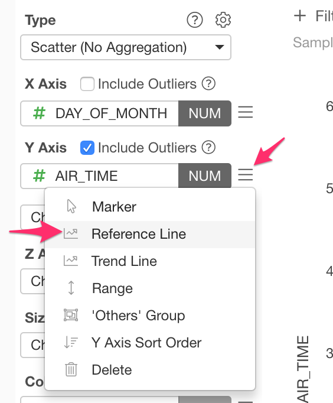
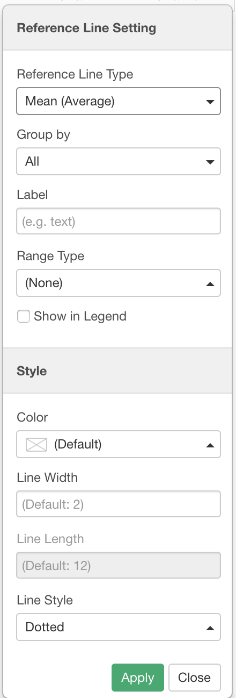
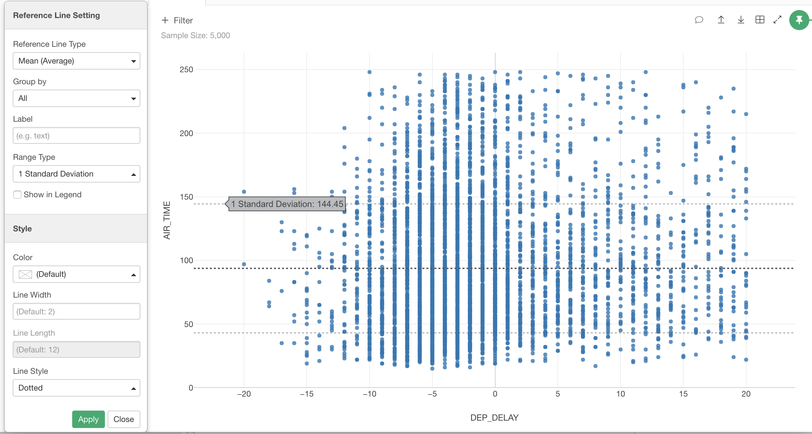

# Reference Line

 Reference Line feature is available in the following chart types. 

* Bar: Y-Axis
* Line: Y-Axis
* Scatter (No Aggregation): X-Axis, Y-Axis
* Scatter (With Agggregation): X-Axis, Y-Axis

Reference Line is available only when a numeric column is assigned to the target Axis. 

## How to Use 

You can configure the Reference Line on the Reference Line dialog. You can open the Reference Line dialog by choosing 'Reference Line' menu from the Axis menu dropdown. 

In the Reference Line dialog, you can select the type and style of the Reference Line. 

## Types

Following Reference Line types are available. 

* (None)
* Sum 
* Mean (Average): 
* Median
* Mode 
* Min Value
* Max Value
* First: First value of the data. 
* Last: Last value of the data. 
* Diagonal: It is available in Scatter (No Aggregation and With Aggregation) and numeric columns are assigned to both X and Y. 
* Constant: Constant value that you specify. 

## Options

* Group By
  * All - Against the all data.
  * X Axis - For each X Axis. 
  * Repeat By - For each Repeat By.
  * X Axis + Repeat By - For each X Axis and Repeat By. 
* Label - Label text that will show up in Popup and Legend.
* Range Type - You can show the value distribution range. Only available for 'Mean' and 'Median' Reference Line types.
  * (None)
  * Standard Error 
  * 95% Conf. Interval
  * 99% Conf. Interval
  * 1 Standard Deviation
  * 2 Standard Deviation
  * 3 Standard Deviation
  * IQR
  
  
  
* Show in Legend - Check if you want to show the Reference Line item in the Legend.
* Color 
* Line Width: Thickless of the line.
* Line Length
* Line Style 
  * Solid
  * Dotted 
  * Dot and Dash
