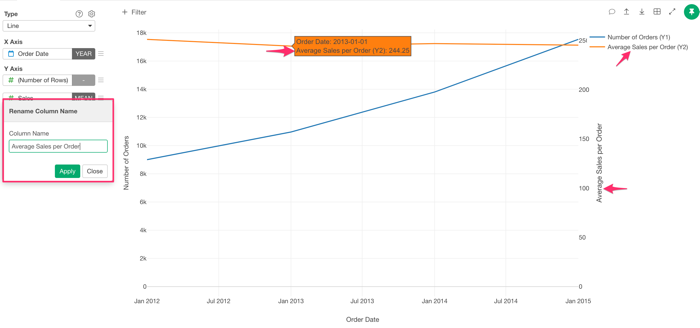
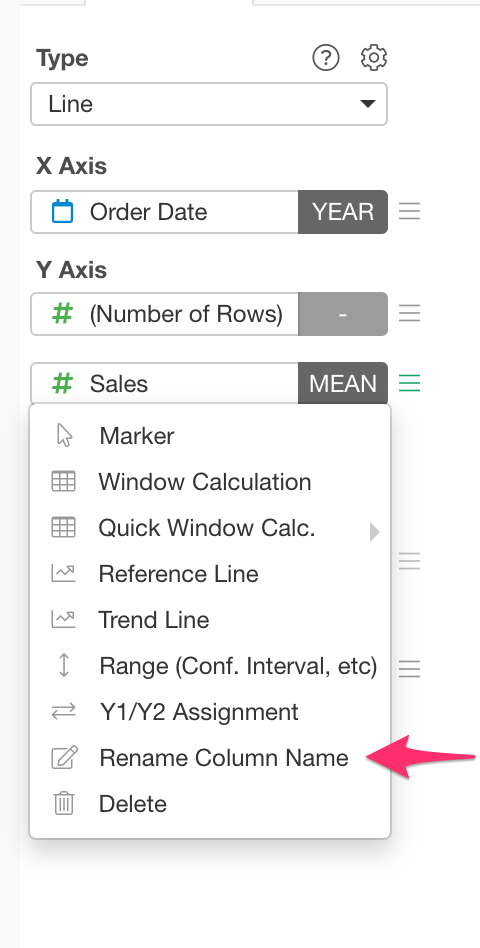

# Rename Column Names
 
You can edit the display name of the column names. This column name change appears on legend, default axis title and Popup.

You can acesss "Rename Column Names" dialog from Y-Axis menu. This menu currently shows up in Y-Axis menu when you have multiple columns at Y-Axis.  

