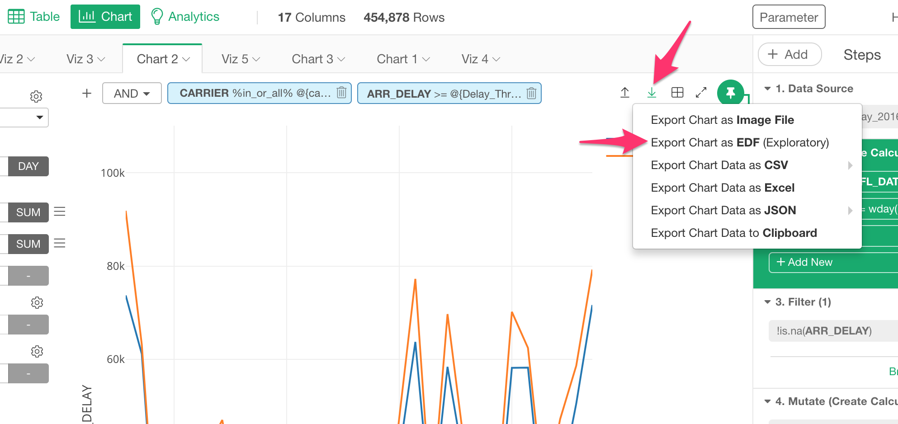
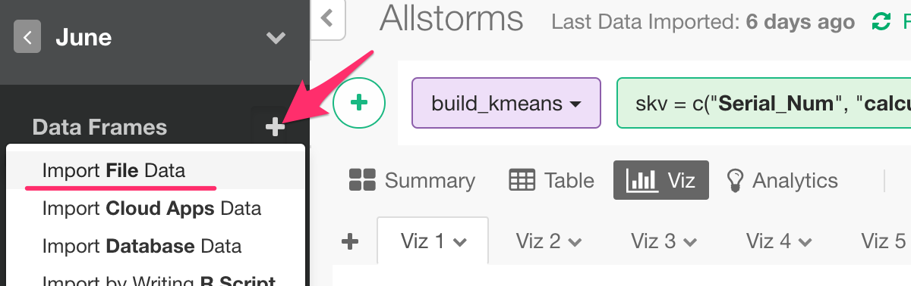
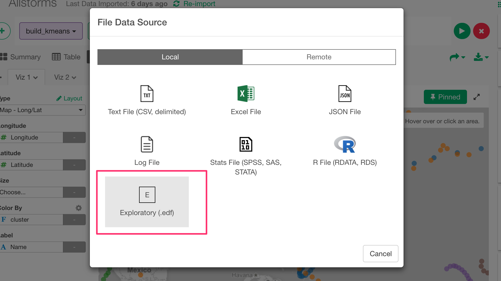
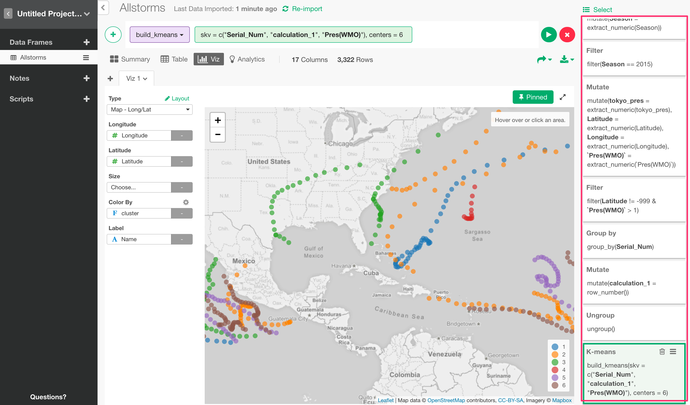

# Export Chart as EDF (Exploratory Data File)

You can export the chart as EDF (Exploratory Data Format). This EDF file includes not only the chart configuration but also the data reproducing steps, which means that you can import it in another project and all the steps that would produce the chart data will be reproduced and shown at the right hand side. This would be useful when others want to not only see the chart but also want to understand how the data wrangling has been done and want to update the steps.

### Export

1. Click on Export button.
2. Select 'Export Chart as EDF'.

### Import

In another project, simply import the EDF file by selecting 'Import File Data'.

And, select 'Exploratory (.edf)'.

This will import the EDF and reproduce the chart along with all the data wrangling steps so that you or others will be able to view/update the steps.

