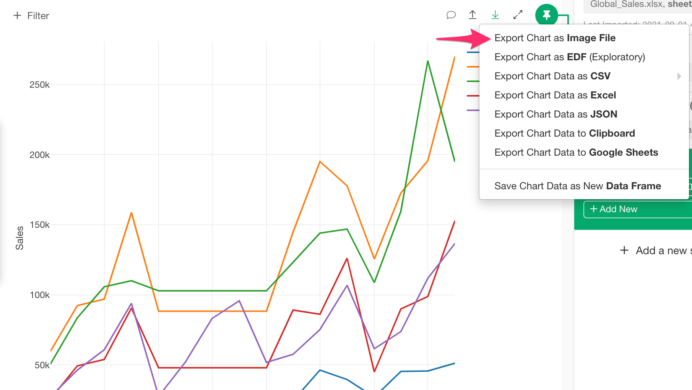
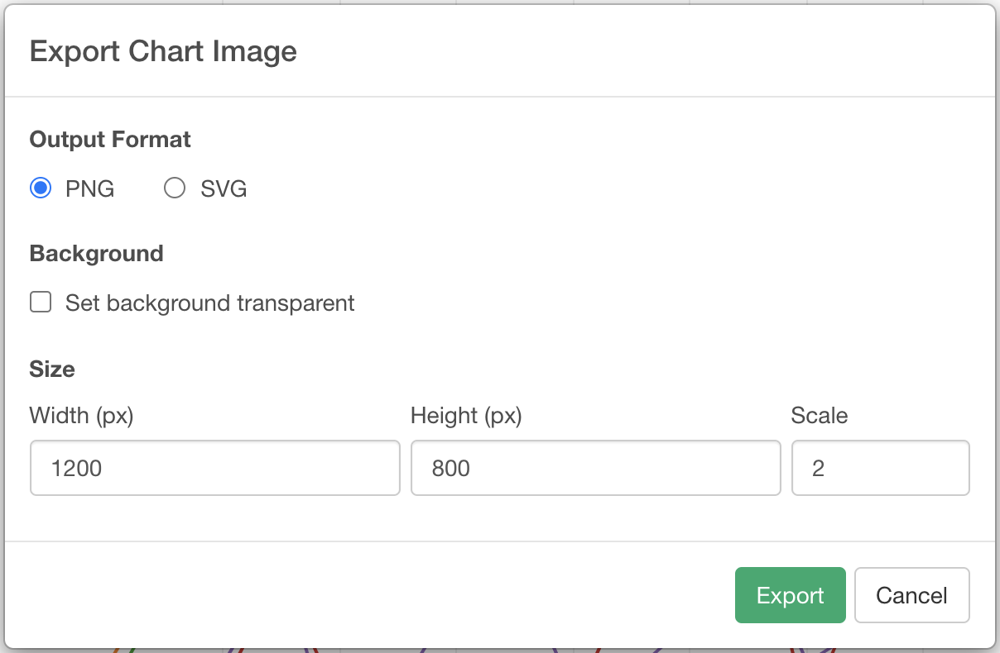

# Save Chart as PNG / SVG

You can export the chart in PNG or SVG format by the "Export Chart as Image File" option in the Export dropdown menu.

## Output Format

The following options are available. 

* PNG
* SVG
## Background

The following options are available. 

* Set Background Transparent - You can check this option to make the background of the exported image transparent.
## Size

* Width - Width of the image.
* Height - Height of the image.
* Scale - You can set a higher scale to export the chart image in a larger size with keeping the chart marker, legend, and text ratio. For example, if you set 800 to Width, 600 to Height, and 2 for Scale, the actual size of the exported image will have 1600px width and 1200px height.  

