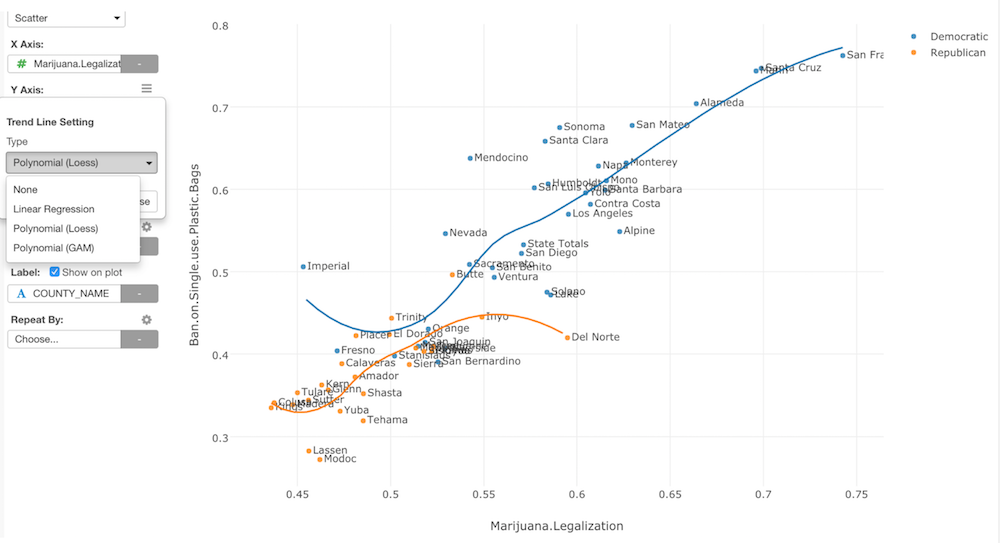
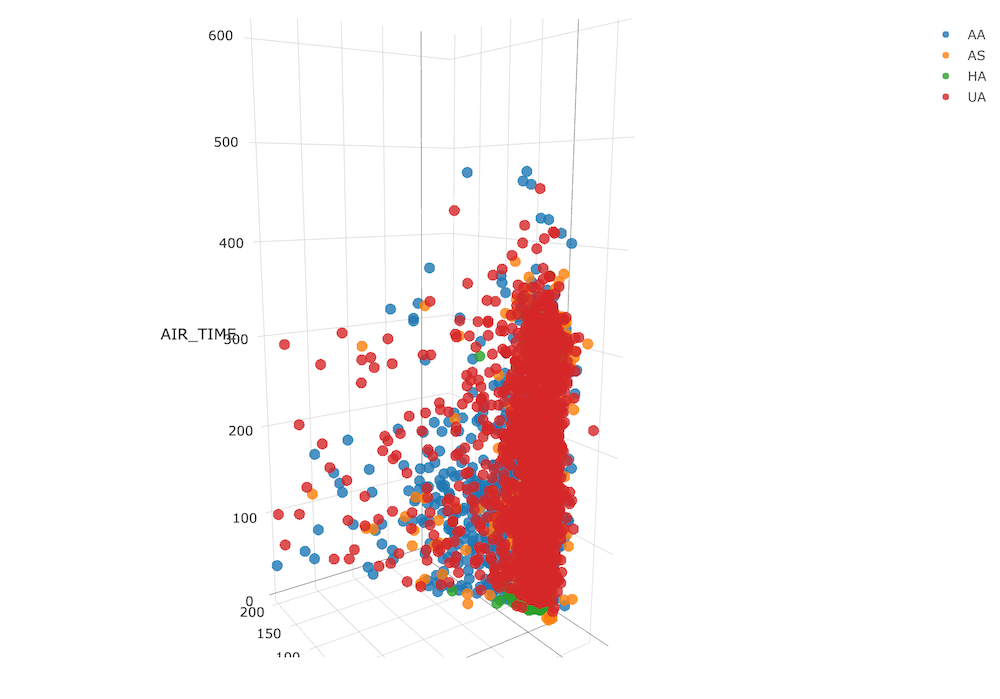
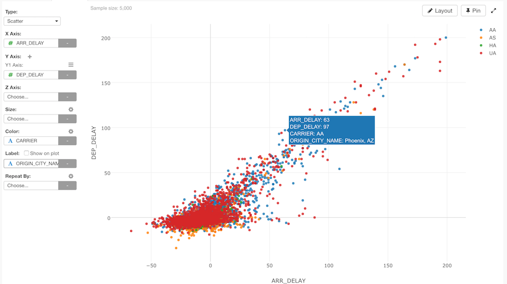
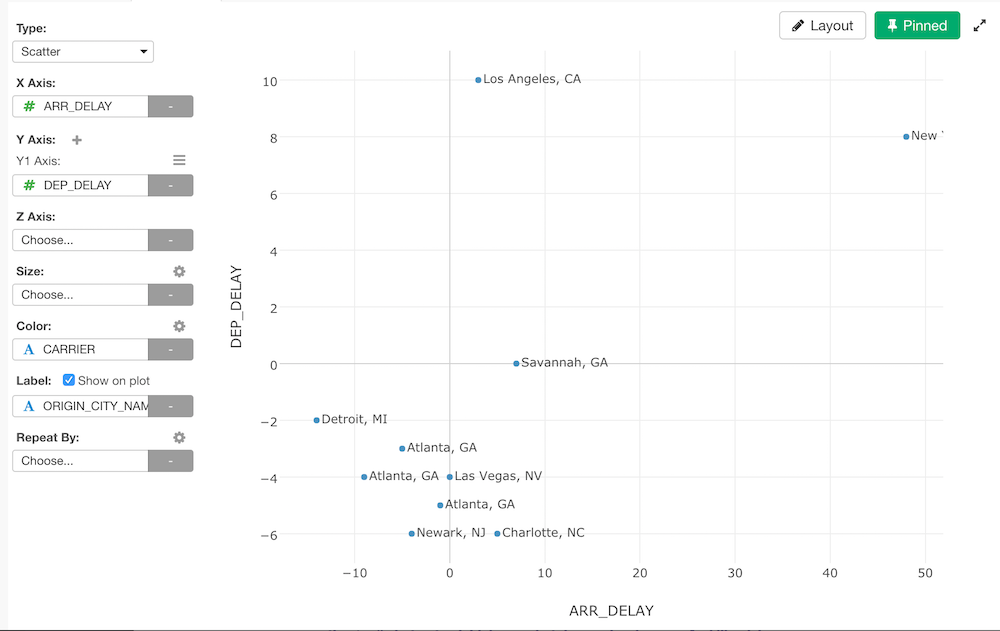
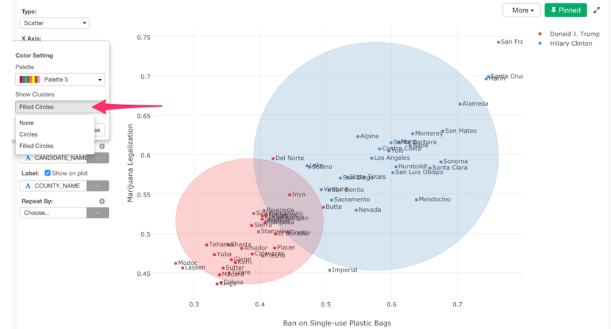

## Scatter Chart

## Column Assignments

* X-Axis - Assign a column you want to show at X-Axis. If it is a date / time column assigned, the axis will be automatically in time series. If it is a number based column, the axis will be for the continuous values. If it is a text based column, the axis will be for discrete values. 
* Y-Axis - Assign a column you want to show at Y-Axis. The assigned column is handled in the same way as X-Axis.  
* Z-Axis - Assign a column you want to show at Z-Axis. By assigning Z-Axis, the chart becomes 3D Scatter chart. The assigned column is handled in the same way as X-Axis. Note that on Windows with some hardware and driver, 3D scatter chart may not work. In that case, you can install [DirectX 9 redistributable](http://www.microsoft.com/en-us/download/details.aspx?id=8109) to make it work. 

* Size - Assign a column you want to apply the size on each circle. You can assign a number based column only. 
* Color - Take a look at [Color](color.md) section for more details.
* Label - Assign a column you want to show in the balloon help that you see when you hover the marker such as dots. 

If you check the `Show on plot` option, the column values directly come up in the plot area. 

* Repeat By - You can assign a column to repeat the chart for each of its values. Take a look at [Small Multiple](small-multiple.md) section for more details.

You can assign multiple columns to Y-Axis. Take a look at [Multiple Y-Axis](multi-y.md) section for more details.

## Trend Line

Take a look at [Trend Line](trend-line.md) section for more details.

## Range

Take a look at [Range](range.md) section for more details.

## Circle for Color 

You can draw circles for each color group. It is useful to see the distributions of each group. You can access the Circles for Color feature from the Color property dialog that you can access by clicking the gear icon at the Color control. 

Following circle types are available.

* Circles - Circles without fill colors
* Filled Circles - Circles filled with colors

## Highlight 

You can change the color of the specific markers such as bars, lines or circles that you pick to stand out from others. See [Highlight](highlight.md) for the detail. 

## Layout Configuration

Take a look at [Layout Configuration](layout.md) on how to configure the layout and format. 

## Note about 3D Scatter on Windows

On Windows with some hardware and driver, 3D scatter chart may not work. In that case, you can install [DirectX 9 redistributable](http://www.microsoft.com/en-us/download/details.aspx?id=8109) to make it work. 
