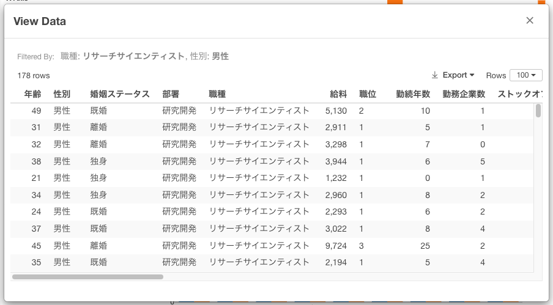

# Show Detail

You can show the detailed data underlying the chart by clicking the chart figure or number. 

## Rows

You can change how many rows to show from the "Rows" dropdown menu.

## Export

You can export the detailed data in the following formats. It exports all the data regardless of the "Rows" setting. 

* CSV
* Excel
* JSON
* Parquet
* Clipboard
* Google Sheets

