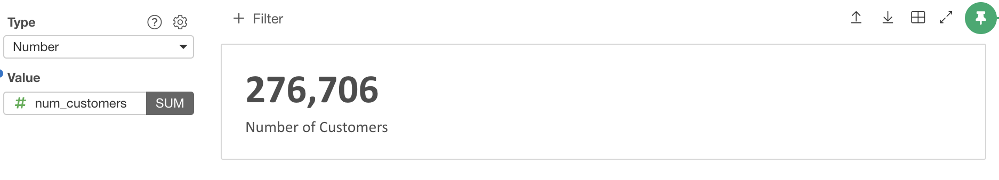
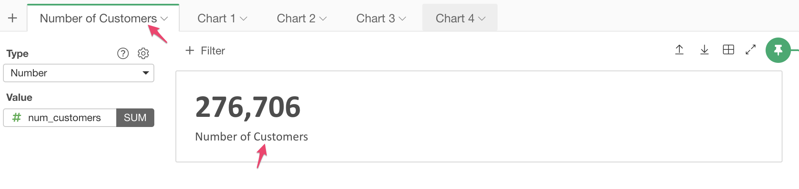

# Number Chart

You can show a single, aggregated number. It is good for tracking a specific number, and it is good for using it in Dashborads.  

## Column Assignments

* Value - Assign a data column you want to show. It can be in any data types. 

## Changing the caption text

You can rename the chart then the same name comes up as a caption. 

 

## Custom Function

You can use the Custom Function feature to define your own aggregation function. See [Custom Function](custom-function.md) for the detail.

## Layout Configuration

* Default Value - The default text value used when the data is NA. The default is '<NA>'.

Take a look at [Layout Configuration](layout.md) on how to configure the layout and format. 
