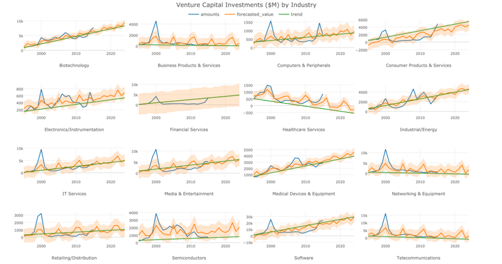
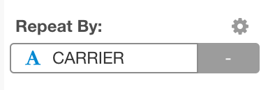
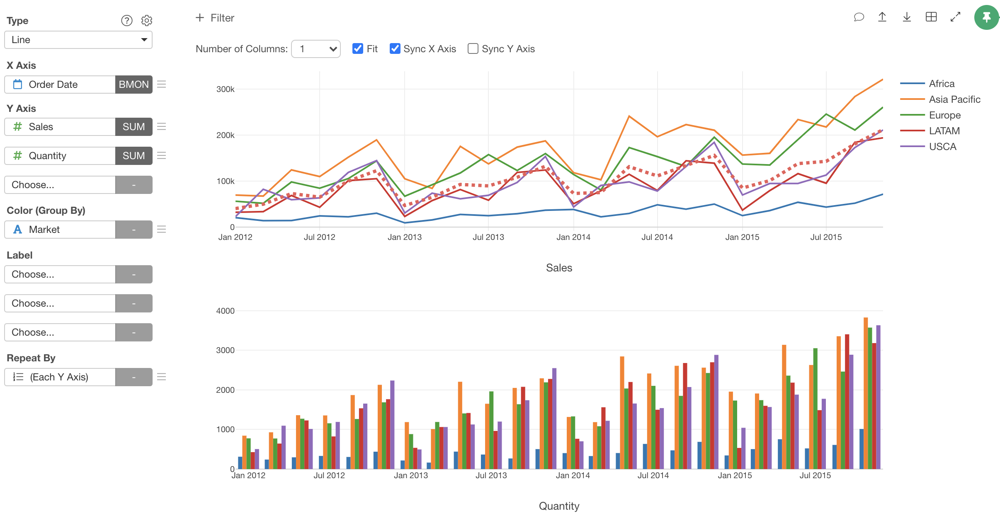
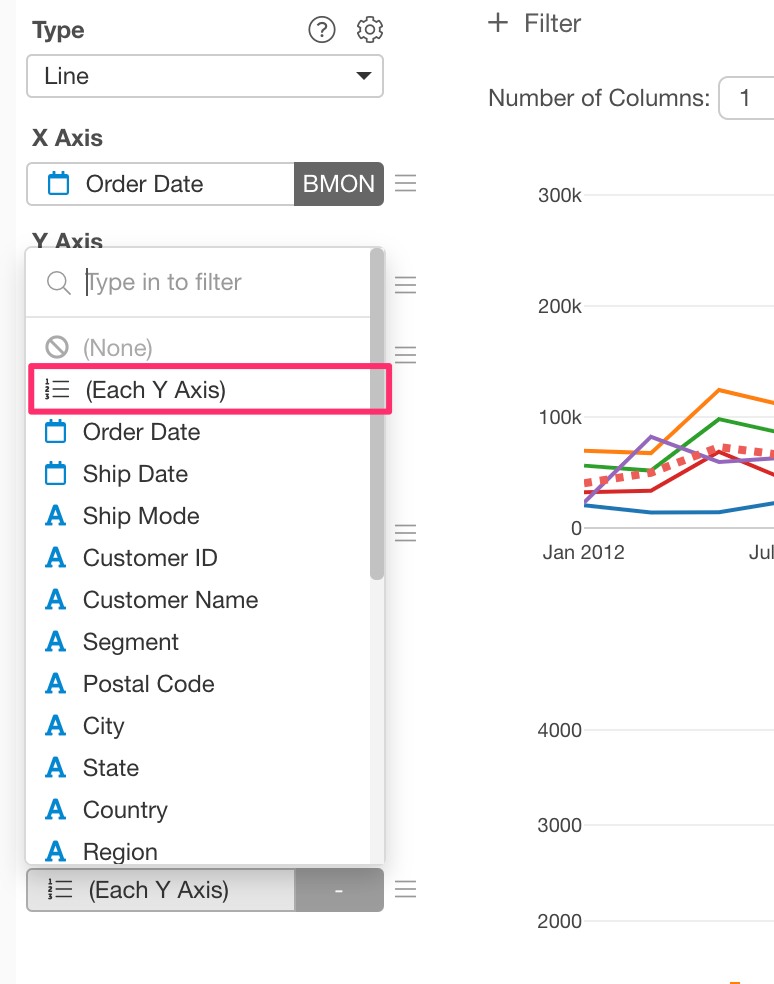
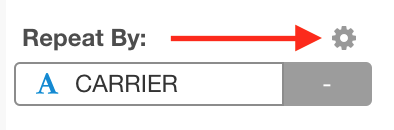
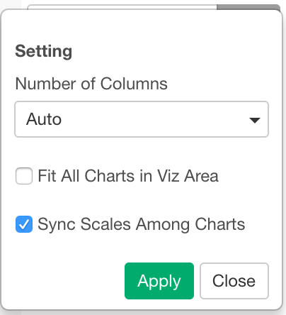

# Repeat By

With Repeat By, you can show multiple charts by groups at a time on the same chart area. It is useful to capture/compare the trends and characteristics of groups at a glance. 

The Repeat By feature is available for following chart types. 

* Bar 
* Line 
* Area 
* Histogram 
* Scatter (No Aggregation) 
* Scatter (With Aggregation) 
* Error Bar

## Using Repeat By 

You can assign a column you want to group by and repeat at the Repeat By control. Values in the assigned column are treated as discrete values (as text). 

## Repeat By Y-Axis Columns

If you assign multiple columns to Y-Axis, you can treat those columns as groups and repeat the chart by those columns.

You can choose "(Each Y Axis)" option shows up in the Repeat By dropdown. This option shows up when you have assign multiple columns to Y-Axis.

## Sort Order 

The sorting order of the charts is ascending. If you assign a factor column to the Repeat By, it respects the order of factor levels. 

## Options

You can open the Repeat By property dialog by clicking the gear icon at the Repeat By control. 

Following options are available on the Repeat By property dialog. 

* Number of Columns 
  * Auto 
  * Static (1 - 15)
* Fill All Charts in Viz Area 
* Sync Scales Among Charts 

## Links

Take a look at following articles for more details about the Repeat By. 

* [Quick Introduction to Small Multiple Charts in Exploratory](https://blog.exploratory.io/quick-introduction-to-small-multiple-chart-6386745034bc)
