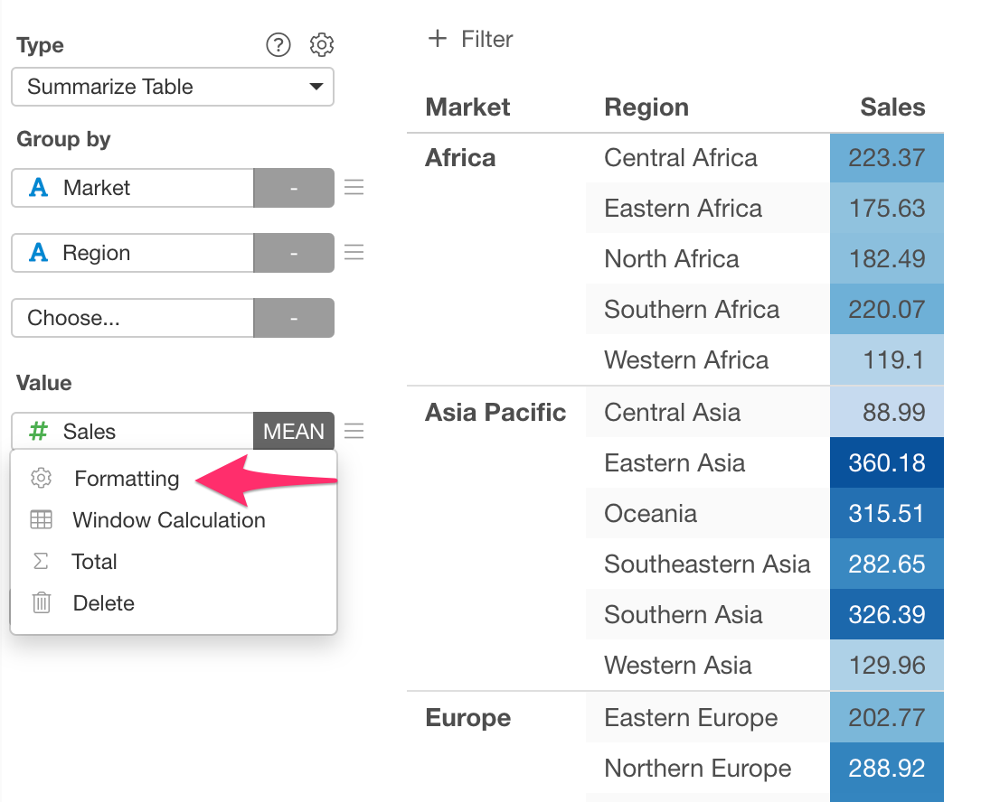
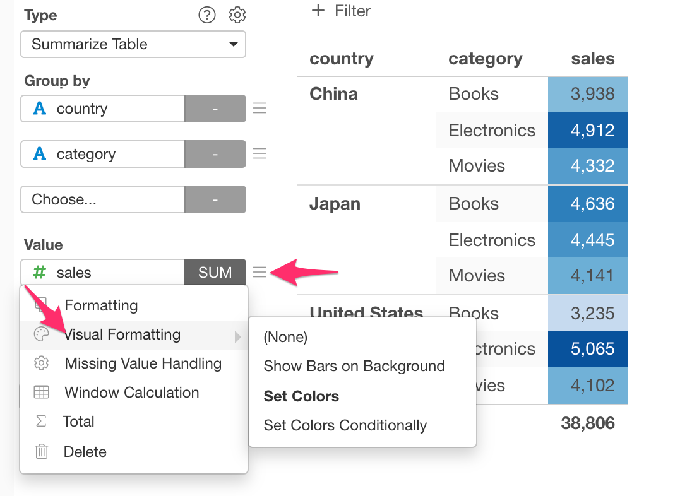

# Summarize Table 

Pivot Table makes it super easy to not only summarize (aggregate) data but also spot outliers or patterns quickly by using color. And, just like any other visualization (chart) types, you can share it with reproducible data preparation steps simply by clicking a button and start having a conversation around the data.

## Column Assignments

* Group By - Assign a column you want to group by. You can assign multiple columns to Group By. If it's a Date / Time column assigned, you can select the aggregation level such as `Month`, `Week`, `Day`, etc. 
* Value - Assign a column you want to show at the value area. You can assign multiple columns to Value. If a numeric column is assigned, you can set the aggregation function such as `Sum`, `Mean (Average)`, etc. to aggregate the values. If it is a non-numeric column, you can set a count-based aggregation function such as `Unique Count` or a function to pick one of the values in the group such as "First (First Row)". 
* Total - You can choose what type of totals you want to show. The following options are available. 
  * None 
  * Totals Only 
  * Subtotals Only 
  * Totals and Subtotals

## How to Change the Aggregation Function for Total

The default aggregation function for Totals and Subtotals depends on the aggregation function that you use for the Value calculation. 

You can change the Totals/Subtotals aggregation function from the "Total" menu of each Value column. 

It opens up the Total Setting dialog. You can change the aggregation function for totals and subtotals from the dropdown menu.  

## Formatting Columns

You can format each Row Header and Value column. You can access the Column Format dialog by selecting the "Formatting" menu in the column menu next to the column name dropdown. See 
[Column Configuration Dialog](column-configuration-dialog.md) for mode details.

## Color Assignment 

You can quickly apply the color formatting from the "Color Assignment" column menu. You can configure the formatting details in the [Column Configuration Dialog](column-configuration-dialog.md).

## Fit to Screen

You can fit the table to the chart viewing area by the "Fit to Screen" option in the chart property dialog. See [Fit to Screen (Table)](viz/table-fit-to-screen.md) for more details.

## Window Calculation 

You can assign Window Calculations for each column at Value. See [Window Calculation](window-calc.md) for more details.

## Visual Sort 

You can sort by the column by clicking the column header. Note that the sort happens only for the rows displayed.

## Category 

You can categorize numeric values at Row. See [Category(Binning)](category.md) for the detail.

## Limit Values

You can use Limit Values to filter the categories by the aggregated values. See [Limit Values](limit.md) for the detail. 

## 'Others' Group

If you have many categories, you can reduce the number of categories by changing some category names to 'Others' using the 'Others' Group feature. See ['Others' Group](others-group.md) for the detail. 

## Custom Function

You can use the Custom Function feature to define your own aggregation function at Value. See [Custom Function](custom-function.md) for the detail.

## Calculation Target for Total Calculation

You can choose how to calculate the totals/subtotals at the Calculation Target in the Setting dialog for total.

* Data After Aggregation: Totals and subtotals are calculated based on the cell values in the Pivot Table which are already aggregated. 
* Data Before Aggregation: Totals and subtotals are calculated based on the raw data before any aggregations. 

## Show Detail

You can show the detailed data underlying the chart by clicking the value text. See [Show Detail](show-detail.md) for the detail.

## Layout Configuration

Take a look at [Layout Configuration](layout.md) on how to configure the layout and format. 
