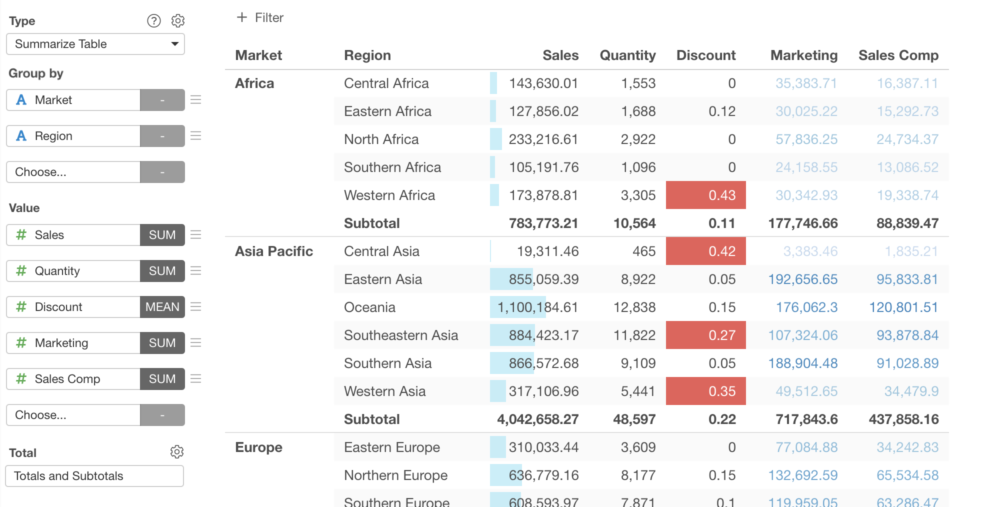

# Summarize Table 

Pivot Table makes it super easy to not only summarize (aggregate) data but also spot outliers or patterns quickly by using color. And, just like any other visualization (chart) types you can share it with reproducible data preparation steps simply by clicking a button and start having a conversation around the data.

## Column Assignments

* Row - Assign a column you want to show at Row Headers. You can assign multiple columns to Row. If it's a Date / Time column assigned, you can select the aggregation level such as `Month`, `Week`, `Day`, etc. 
* Value - Assign a column you want to show at the value area. You can assign multiple columns to Value. If a numeric column is assigned, you can set the aggregation function such as `Sum`, `Mean (Average)`, etc. to aggregate the values. If it is non-numeric column, you can set a count-based aggregation function such as `Unique Count` or a function to pick one of values in the group such as "First (First Row)". 

## Totals and Subtotals

You can choose what type of totals you want to show in the Summarize Table. The following options are available. 
  * None 
  * Subtotals Only 
  * Totals Only 
  * Totals and Subtotals

## How to Change the Aggregation Function for Total

The default aggregation function for Totals and Subtotals depends on the aggregation function that you use for the Value calculation. 

You can change the Totals/Subtotals aggregation function from the "Total" menu of each Value column. 

It opens up the Total Setting dialog. You can hange the aggregation function for totals and subtotals from the dropdown menu.  

## Formatting Columns

You can format each Row Header and Value column. You can access the Column Format dialog by selecting "Format" menu in the column menu next to the column name dropdown. See 
[Column Configuration Dialog](column-configuration-dialog.md) for mode details.

## Window Calculation 

* You can assign Window Calculations for each column at Value. See [Window Calculation](window-calc.md) for more details.

## Visual Sort 

You can sort by the column by clicking the column header. Note that the sort happens only for the rows dislayed.

## Category 

You can categorize numeric values at Row. See [Category(Binning)](category.md) for the detail.

## Custom Function

You can use the Custom Function feature to define your own aggregation function at Value. See [Custom Function](custom-function.md) for the detail.

## Layout Configuration

Take a look at [Layout Configuration](layout.md) on how to configure the layout and format. 
