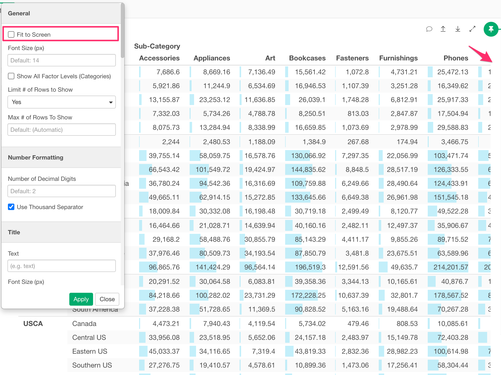
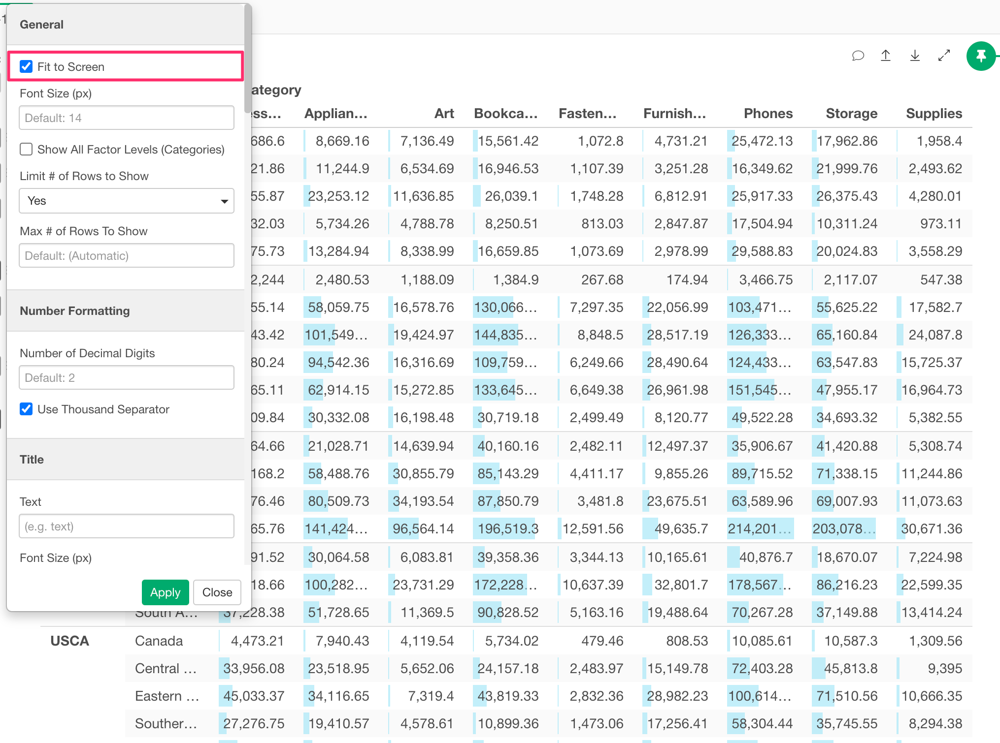
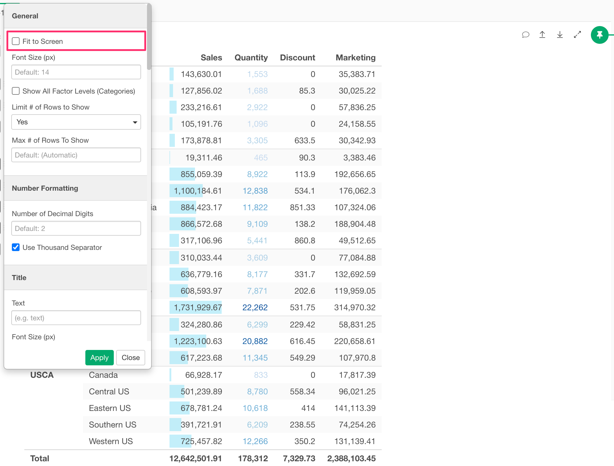
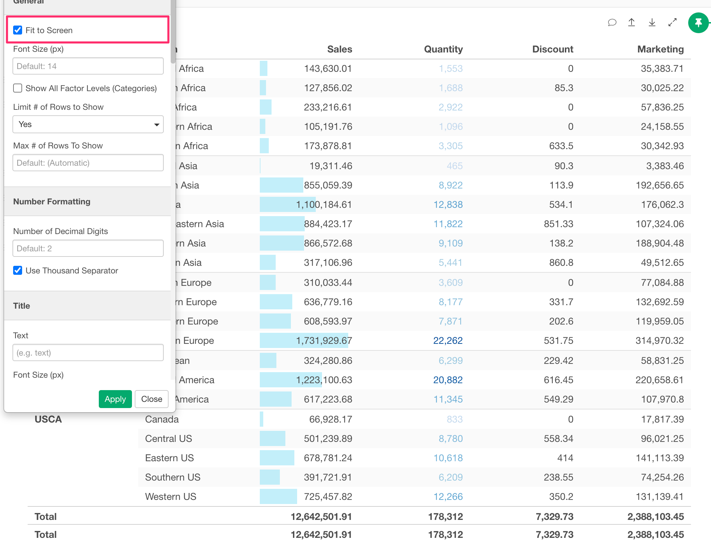

# Fit to Screen 

You can fit the table to the chart viewing area by the "Fit to Screen" option in the chart property dialog. The following chart types support this option.

* Pivot Table
* Summarize Table
* Table

Suppose you have a wider table that overflows the chart viewing area like the following.

You can check the "Fit to Screen" option to fit the table into the chart viewing area. It tries to fit as much as possible, but if you have too many columns, it may still overlow.  

You can use this option for the narrower table too. Suppose you have a 4-column table like the following.

You can check the "Fit to Screen" option to stretch the column width to fit the table into the chart viewing area. 

You can lock the column width for specific columns by setting the Column Width. See [Column Configuration Dialog](column-configuration-dialog.md) for mode details.

