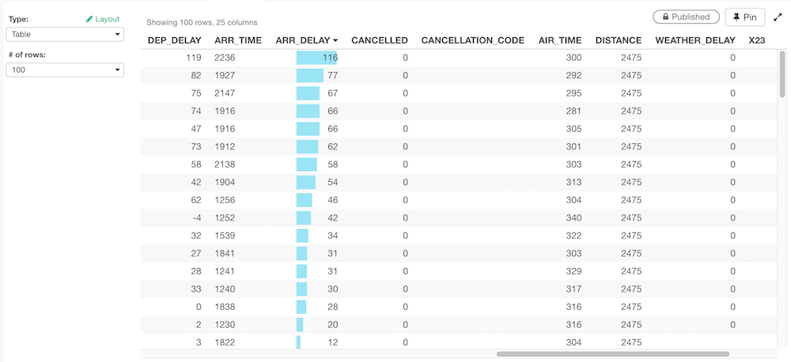

# Table

You can view the raw data quickly with Table. 

## # of Rows

You can select how many rows to show at "# of Rows" control. 

## Sort 

You can sort by the column by clicking the column header.  If it is a numeric column, it also shows the micro bar charts. Note that the sort happens only for the rows fetched. 

## Layout Configuration

Take a look at [Layout Configuration](layout.md) on how to configure the layout and format. 
