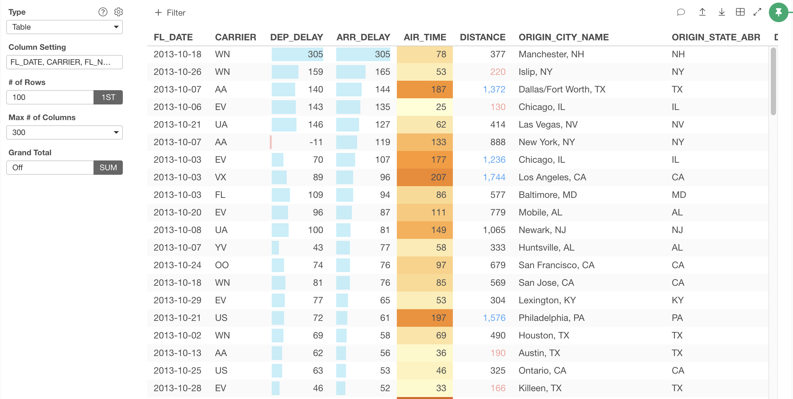

# Table

You can view the raw data quickly with Table. 

## Columns 

You can select which columns to show in the table. See [Column Configuration](column-configuration.md) for detail.

## # of Rows

You can select how many rows to show at "# of Rows" control. You can also change either showing the first rows or last rows in the data frame. 

## Max # of Columns

You can select how many columns to show at "Max # of Columns" control. You can choose either "300", "1,000" or "10,000". Note that if you have many columns and choose a large number here, it may slow down the table rendering. 

## Sort 

You can sort by the column by clicking the column header.  If it is a numeric column, it also shows the micro bar charts. Note that the sort happens only for the rows fetched. 

## Layout Configuration

Take a look at [Layout Configuration](layout.md) on how to configure the layout and format. 
